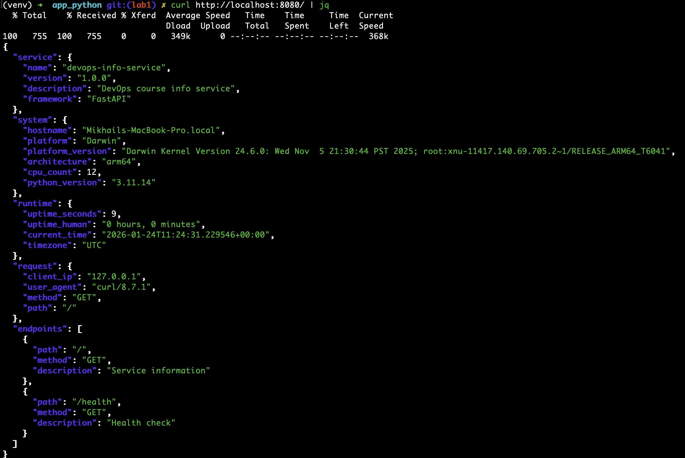
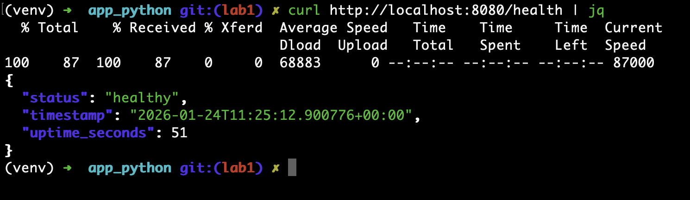

# LAB01 – DevOps Info Service (Python / FastAPI)

## 1. Framework Selection

I chose **FastAPI** because it is async, type‑hint friendly, and gives automatic request validation and OpenAPI docs while staying small and easy to start.

| Framework | Why use it                               | Why I did not pick it                |
|-----------|------------------------------------------|--------------------------------------|
| FastAPI   | Async, type hints, auto docs, small core | -                                    |
| Flask     | Very simple, huge ecosystem              | No built‑in typing/validation layer  |
| Django    | Full stack (ORM, admin, templates)       | Too heavy for only `/` and `/health` |

## 2. Best Practices Applied

- **Clean code organization** – configuration, helpers, and endpoints are separate:

  ```python
  def get_system_info() -> dict:
      return {"hostname": socket.gethostname(), "platform": platform.system()}

  @app.get("/")
  async def index(request: Request) -> dict:
      return {"system": get_system_info(), "request": get_request_info(request)}
  ```

  This keeps each function small and focused, which makes later changes (for tests or metrics) safer.

- **PEP 8 and docstrings** – descriptive names and module/function docstrings instead of inline comments:

  ```python
  START_TIME: datetime = datetime.now(timezone.utc)

  def get_uptime() -> dict:
      """Calculate uptime in seconds and human readable form."""
  ```

  Consistent style and docstrings make the code easier to read and to auto‑document.

- **Error handling** – custom handlers return JSON instead of HTML error pages:

  ```python
  @app.exception_handler(StarletteHTTPException)
  async def http_exception_handler(request: Request, exc: StarletteHTTPException):
      return JSONResponse({"error": "HTTP Error", "message": exc.detail}, exc.status_code)
  ```

  This gives clients predictable and readable error structures.

- **Logging** – one logging configuration used across the app:

  ```python
  logging.basicConfig(level=logging.INFO)
  logger = logging.getLogger(APP_NAME)
  logger.info("Starting DevOps Info Service on %s:%s", HOST, PORT)
  ```

  Logs make it clear when the app starts, what requests hit it, helps to debug failures.

- **Pinned dependencies and .gitignore** – reproducible installs and no noisy files in git:

  ```text
  # requirements.txt
  fastapi==0.115.0
  uvicorn[standard]==0.32.0
  ```

  ```gitignore
  __pycache__/
  venv/
  *.log
  .DS_Store
  ```

  This keeps environments consistent between machines and avoids committing local or OS‑specific files.

## 3. API Documentation

`jq` is used in the examples below to pretty‑print JSON responses, it can be installed by following the official [documentation](https://jqlang.github.io/jq).

### 3.1 `GET /`

- **Description:** Returns service, system, runtime, request, and endpoint metadata.
- **Example request:**

```bash
curl http://localhost:5000/ | jq
```

- **Example response:**

```json
{
  "service": {
    "name": "devops-info-service",
    "version": "1.0.0",
    "description": "DevOps course info service",
    "framework": "FastAPI"
  },
  "system": {
    "hostname": "Mikhails-MacBook-Pro.local",
    "platform": "Darwin",
    "platform_version": "Darwin Kernel Version 24.6.0: Wed Nov  5 21:30:44 PST 2025; root:xnu-11417.140.69.705.2~1/RELEASE_ARM64_T6041",
    "architecture": "arm64",
    "cpu_count": 12,
    "python_version": "3.11.14"
  },
  "runtime": {
    "uptime_seconds": 1009,
    "uptime_human": "0 hours, 16 minutes",
    "current_time": "2026-01-24T11:11:49.388345+00:00",
    "timezone": "UTC"
  },
  "request": {
    "client_ip": "127.0.0.1",
    "user_agent": "curl/8.7.1",
    "method": "GET",
    "path": "/"
  },
  "endpoints": [
    {
      "path": "/",
      "method": "GET",
      "description": "Service information"
    },
    {
      "path": "/health",
      "method": "GET",
      "description": "Health check"
    }
  ]
}
```

### 3.2 `GET /health`

- **Description:** Lightweight health check used later for probes.
- **Example request:**

```bash
curl http://localhost:5000/health | jq
```

- **Example response:**

```json
{
  "status": "healthy",
  "timestamp": "2026-01-24T11:12:15.235487+00:00",
  "uptime_seconds": 1034
}
```

### 3.3 Testing commands

Commands used to test both endpoints locally (default port 8080):

```bash
# Start the app
cd app_python
source venv/bin/activate
python app.py

# Test main endpoint
curl http://localhost:8080/
curl http://localhost:8080/ | jq

# Test health endpoint
curl http://localhost:8080/health
curl http://localhost:8080/health | jq
```

## 4. Testing Evidence

Main endpoint JSON response:


Healthcheck endpoint JSON response:


Terminal output from this app run :

```text
(venv) ➜  app_python git:(lab1) ✗ python app.py
2026-01-24 14:24:21,364 - devops-info-service - INFO - Starting DevOps Info Service on 0.0.0.0:8080 (debug=False)
INFO:     Started server process [67087]
INFO:     Waiting for application startup.
INFO:     Application startup complete.
INFO:     Uvicorn running on http://0.0.0.0:8080 (Press CTRL+C to quit)
2026-01-24 14:24:31,229 - devops-info-service - INFO - Handling request on GET / from 127.0.0.1
INFO:     127.0.0.1:65190 - "GET / HTTP/1.1" 200 OK
INFO:     127.0.0.1:65226 - "GET /health HTTP/1.1" 200 OK
```

## 5. Challenges & Solutions

- **Challenge:** Getting accurate client IP when running locally through FastAPI.
  - **Solution:** Used `request.client.host` when available and fell back to `"unknown"` to avoid crashes when the client object is missing.
- **Challenge:** Keeping uptime logic reusable across endpoints.
  - **Solution:** Implemented a single `get_uptime` helper used by both `/` and `/health`.
- **Challenge:** Returning consistent JSON errors instead of the default HTML pages.
  - **Solution:** Added exception handlers for `StarletteHTTPException`, `RequestValidationError`, and generic `Exception` to log the error and send structured JSON with `error` and `message` fields.

## 6. GitHub Community

Starring repositories helps expose useful tools to the community and signals to maintainers that their work is valuable. Following professors, TAs, and classmates makes it easier to discover new projects, track team activity, and grow a professional network around real coursework.
