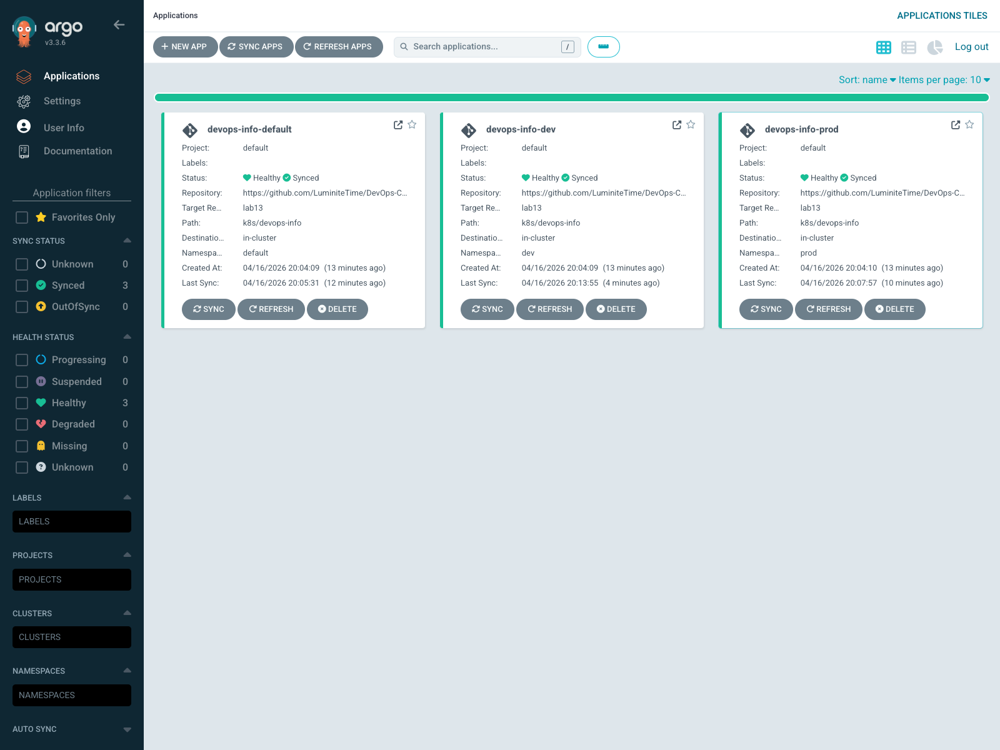
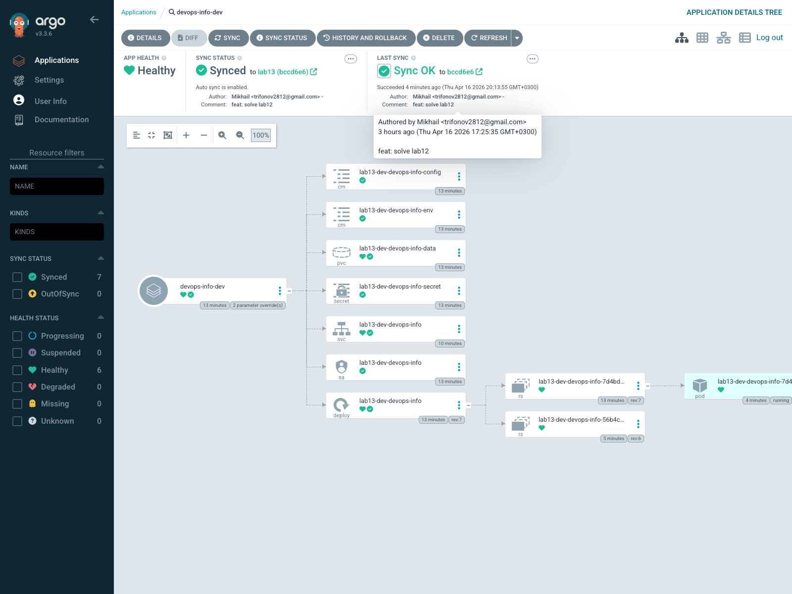

# LAB13 - GitOps with ArgoCD

## 1. ArgoCD Setup

ArgoCD was installed in the dedicated `argocd` namespace with Helm.

```text
$ helm upgrade --install argocd argo/argo-cd -n argocd --wait --timeout 5m
Release "argocd" has been upgraded. Happy Helming!
```

Controller status:

```text
$ kubectl get pods -n argocd
NAME                                               READY   STATUS    RESTARTS   AGE
argocd-application-controller-0                    1/1     Running   0          7m
argocd-applicationset-controller-9f85b7f7d-hxtjx   1/1     Running   0          7m
argocd-dex-server-64766d9569-k6rhx                 1/1     Running   0          7m
argocd-notifications-controller-cdf598886-4x726    1/1     Running   0          7m
argocd-redis-7476bcff9b-gfz9x                      1/1     Running   0          7m
argocd-repo-server-76c5f678c7-jcsnq                1/1     Running   0          7m
argocd-server-66c66bcc9f-rvhvh                     1/1     Running   0          7m
```

UI access used local port-forwarding:

```text
$ kubectl port-forward svc/argocd-server -n argocd 8080:443
Forwarding from 127.0.0.1:8080 -> 8080
```

CLI access:

```text
$ argocd version --client
argocd: v3.3.6+998fb59.dirty
  BuildDate: 2026-03-27T19:12:28Z
  GitTag: v3.3.6
  Platform: darwin/arm64
```

## 2. Application Configuration

The manifests are stored in `k8s/argocd/`:

- `application.yaml` deploys the default environment to `default`
- `application-dev.yaml` deploys the development environment to `dev`
- `application-prod.yaml` deploys the production environment to `prod`
- `applicationset.yaml` contains the bonus List generator

All applications use:

- repository: `https://github.com/LuminiteTime/DevOps-Core-Course.git`
- revision: `lab13`
- chart path: `k8s/devops-info`

The ArgoCD Applications override the service to `ClusterIP` to avoid `NodePort` conflicts between namespaces.

Application list:

```text
$ kubectl get application -n argocd
NAME                  SYNC STATUS   HEALTH STATUS
devops-info-default   Synced        Healthy
devops-info-dev       Synced        Healthy
devops-info-prod      Synced        Healthy
```

The application was reachable after the first sync:

```text
$ curl -sS http://127.0.0.1:18080/ | jq '.service.version, .service.name, .service.description'
"1.0.0-helm"
"devops-info-service"
"Helm-managed deployment"
```

## 3. Multi-Environment Deployment

Separate namespaces were used for development and production:

```text
$ kubectl get pods,svc -n dev
NAME                                          READY   STATUS      RESTARTS   AGE
pod/lab13-dev-devops-info-7d4bdd7464-gpr5d    1/1     Running     0          4m
pod/lab13-dev-devops-info-pre-install-p7f6d   0/1     Completed   0          4m

NAME                            TYPE        CLUSTER-IP      EXTERNAL-IP   PORT(S)   AGE
service/lab13-dev-devops-info   ClusterIP   10.98.187.142   <none>        80/TCP    65s
```

```text
$ kubectl get pods,svc -n prod
NAME                                          READY   STATUS    RESTARTS   AGE
pod/lab13-prod-devops-info-69c5dd6b74-47qhb   1/1     Running   0          3m
pod/lab13-prod-devops-info-69c5dd6b74-5gqn7   1/1     Running   0          3m
pod/lab13-prod-devops-info-69c5dd6b74-h5gmj   1/1     Running   0          3m
pod/lab13-prod-devops-info-69c5dd6b74-jcgdx   1/1     Running   0          3m
pod/lab13-prod-devops-info-69c5dd6b74-n8fps   1/1     Running   0          3m

NAME                             TYPE        CLUSTER-IP      EXTERNAL-IP   PORT(S)   AGE
service/lab13-prod-devops-info   ClusterIP   10.103.141.10   <none>        80/TCP    3m
```

Environment policy difference:

- `dev` uses automated sync with `prune: true` and `selfHeal: true`
- `prod` uses manual sync
- `default` also remains manual and was used for the GitOps sync demonstration

This separation allows fast reconciliation in development while keeping production changes explicitly approved.

## 4. Self-Healing Evidence

### Manual scale drift

The development Deployment was scaled manually from 1 replica to 5 replicas. ArgoCD restored the Git-defined state within 5 seconds.

```text
$ kubectl scale deployment lab13-dev-devops-info -n dev --replicas=5
deployment.apps/lab13-dev-devops-info scaled

scaled_at=2026-04-16T17:11:16Z immediate_spec=5
after5s_at=2026-04-16T17:11:21Z after5s_spec=1
```

### Pod deletion

Deleting a pod triggered Kubernetes controller recovery. This happened without any Git change and without ArgoCD changing the desired manifest.

```text
deleted_at=2026-04-16T17:11:28Z old_pod=lab13-dev-devops-info-7d4bdd7464-55mxn
pod "lab13-dev-devops-info-7d4bdd7464-55mxn" deleted
pod/lab13-dev-devops-info-7d4bdd7464-gpr5d condition met
ready_at=2026-04-16T17:11:47Z new_pod=lab13-dev-devops-info-7d4bdd7464-gpr5d
```

This is Kubernetes self-healing: ReplicaSet recreated the missing pod.

### Configuration drift

Changing the Deployment environment variable made the application `OutOfSync`. ArgoCD then restored the Git state.

```text
$ kubectl set env deployment/lab13-dev-devops-info -n dev APP_DESCRIPTION=manual-edit
deployment.apps/lab13-dev-devops-info env updated

2026-04-16T17:13:28Z APP_DESCRIPTION=manual-edit sync=OutOfSync from lab13 (bccd6e6)
2026-04-16T17:13:56Z APP_DESCRIPTION=Development environment sync=Synced to lab13 (bccd6e6)
```

Observed result:

- Kubernetes heals missing pods
- ArgoCD heals configuration drift
- live drift in this cluster was reconciled in about 28 seconds
- Git revision refresh is separate from pod/controller recovery

## 5. GitOps Workflow

The Helm chart was changed in `k8s/devops-info/values.yaml` by updating the default application description and version:

- `APP_DESCRIPTION: Helm-managed deployment via ArgoCD`
- `APP_VERSION: 1.0.0-argocd`

After the `lab13` branch was pushed, ArgoCD detected the new Git revision. The `devops-info-default` application became `OutOfSync` and was then synchronized manually from ArgoCD, which applied the new values to the cluster.

## 6. Screenshots

Applications overview:



Application details:



## 7. Bonus - ApplicationSet

The bonus manifest uses the List generator to define both environments in one template:

- `env`
- `namespace`
- `valueFile`
- `releaseName`
- `autoSync`

Benefits of the ApplicationSet approach:

- one template instead of repeating the same `Application` structure
- environment-specific parameters stay in generator elements
- scaling to more environments requires only new list entries

The generated applications keep the same names as the manually defined environment apps, so the pattern can replace the separate `application-dev.yaml` and `application-prod.yaml` resources without changing the deployment target model.

Verification after replacing the standalone environment Applications:

```text
$ kubectl get applicationset -n argocd
NAME               AGE
devops-info-envs   9s

$ kubectl get application -n argocd -o jsonpath='{range .items[*]}{.metadata.name}{" owner="}{range .metadata.ownerReferences[*]}{.kind}/{.name}{end}{"\n"}{end}'
devops-info-default owner=
devops-info-dev owner=ApplicationSet/devops-info-envs
devops-info-prod owner=ApplicationSet/devops-info-envs
```
