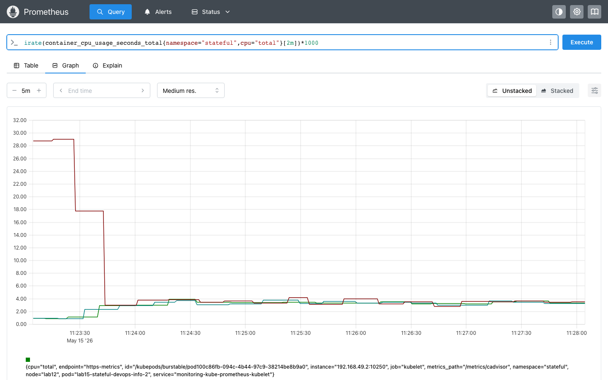
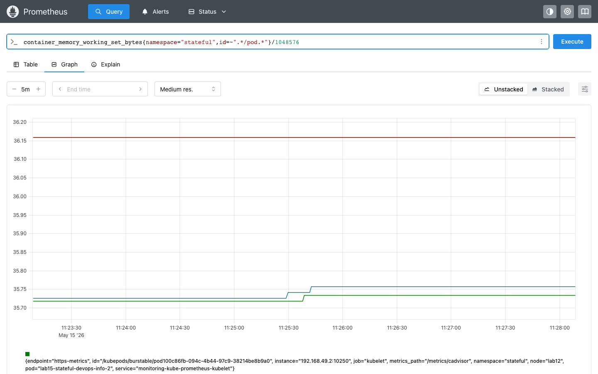
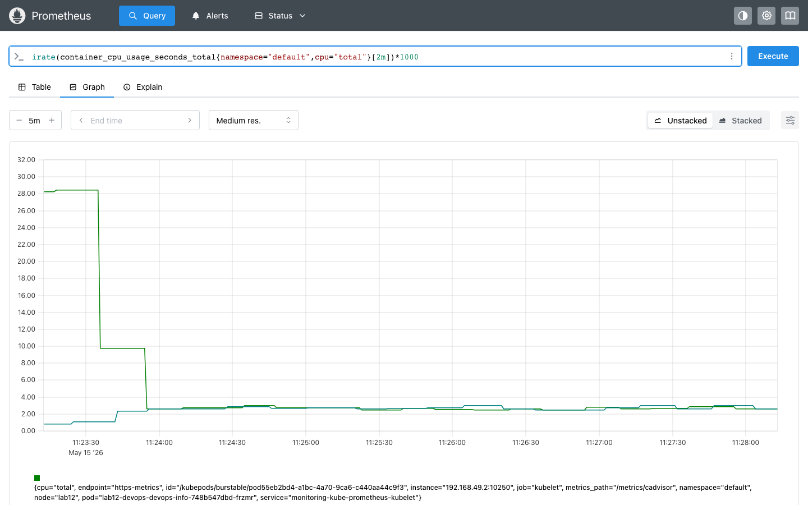
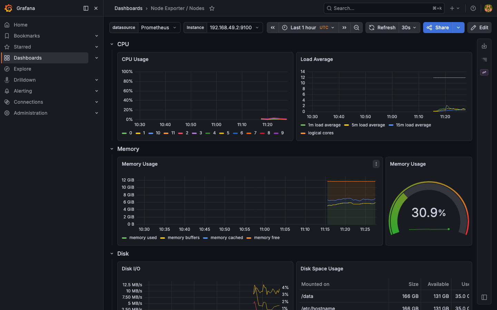
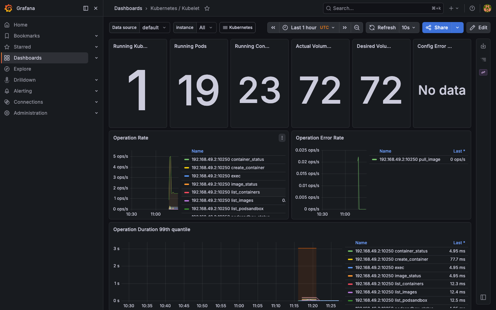
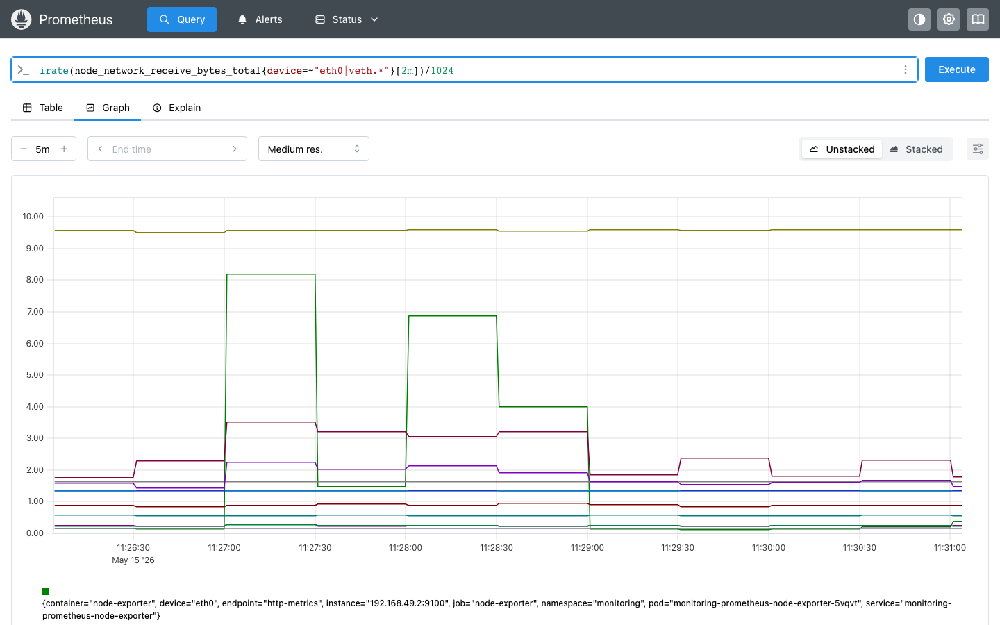
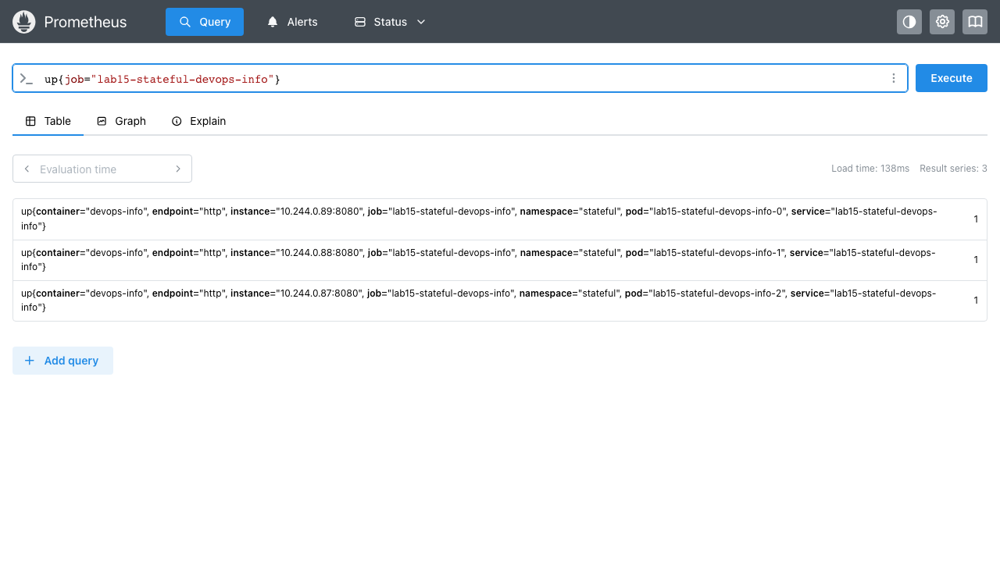

# LAB16 - Kubernetes Monitoring & Init Containers

## 1. Monitoring Stack Components

The `kube-prometheus-stack` chart installs several components with different roles:

- **Prometheus Operator** manages Prometheus, Alertmanager, and related CRDs such as `ServiceMonitor`.
- **Prometheus** scrapes metrics from Kubernetes components and user applications, stores time-series data, and answers PromQL queries.
- **Alertmanager** receives alerts from Prometheus, groups them, and exposes the active alert list.
- **Grafana** provides dashboards for visual analysis of cluster and application metrics.
- **kube-state-metrics** exposes Kubernetes object state such as pods, deployments, PVCs, and StatefulSets.
- **node-exporter** exposes node-level host metrics such as memory, CPU, disks, and network interfaces.

## 2. Installation Evidence

The stack was installed with Helm into the `monitoring` namespace.

```text
$ helm upgrade --install monitoring prometheus-community/kube-prometheus-stack \
    --namespace monitoring \
    --create-namespace
Release "monitoring" has been upgraded. Happy Helming!
```

Healthy stack state after installation:

```text
$ kubectl get pods,svc -n monitoring
NAME                                                         READY   STATUS    RESTARTS   AGE
pod/alertmanager-monitoring-kube-prometheus-alertmanager-0   2/2     Running   0          21m
pod/monitoring-grafana-6c7c49f469-ddhfd                      3/3     Running   0          3m4s
pod/monitoring-kube-prometheus-operator-fbc554898-5ljl5      1/1     Running   4          21m
pod/monitoring-kube-state-metrics-7d69554b96-42qjl           1/1     Running   4          21m
pod/monitoring-prometheus-node-exporter-ls846                1/1     Running   3          21m
pod/prometheus-monitoring-kube-prometheus-prometheus-0       2/2     Running   0          3m

NAME                                              TYPE        CLUSTER-IP       EXTERNAL-IP   PORT(S)                      AGE
service/alertmanager-operated                     ClusterIP   None             <none>        9093/TCP,9094/TCP,9094/UDP   21m
service/monitoring-grafana                        ClusterIP   10.104.248.160   <none>        80/TCP                       21m
service/monitoring-kube-prometheus-alertmanager   ClusterIP   10.107.214.73    <none>        9093/TCP,8080/TCP            21m
service/monitoring-kube-prometheus-operator       ClusterIP   10.106.36.93     <none>        443/TCP                      21m
service/monitoring-kube-prometheus-prometheus     ClusterIP   10.110.72.77     <none>        9090/TCP,8080/TCP            21m
service/monitoring-kube-state-metrics             ClusterIP   10.102.34.1      <none>        8080/TCP                     21m
service/monitoring-prometheus-node-exporter       ClusterIP   10.98.153.153    <none>        9100/TCP                     21m
service/prometheus-operated                       ClusterIP   None             <none>        9090/TCP                     21m
```

Grafana used the default credentials `admin / prom-operator`.

## 3. Dashboard Answers

### 3.1 Pod resources of the StatefulSet

StatefulSet CPU usage at observation time:

- `lab15-stateful-devops-info-2`: `5.30 mCPU`
- `lab15-stateful-devops-info-1`: `1.77 mCPU`
- `lab15-stateful-devops-info-0`: `1.75 mCPU`

StatefulSet memory usage at observation time:

- `lab15-stateful-devops-info-0`: `35.66 MiB`
- `lab15-stateful-devops-info-1`: `35.63 MiB`
- `lab15-stateful-devops-info-2`: `35.54 MiB`

Screenshots:





### 3.2 CPU usage in the `default` namespace

The highest CPU consumer in `default` was `lab13-devops-devops-info-67bc64c557-tpbcm` with `5.23 mCPU`.

The lowest CPU consumer in `default` was `lab12-devops-devops-info-7887d86654-ddxt6` with `1.38 mCPU`.

Intermediate values at the same moment:

- `lab13-devops-devops-info-67bc64c557-8f55j`: `1.54 mCPU`
- `lab13-devops-devops-info-67bc64c557-bcmk8`: `1.50 mCPU`

Screenshot:



### 3.3 Node metrics

The single Minikube node `lab12` reported:

- memory usage: `43.26%`
- used memory: `5194.02 MiB`
- CPU cores: `12`

Screenshot:



### 3.4 Kubelet pod and container count

The Kubelet dashboard reported:

- running pods: `43`
- running containers: `42`

Screenshots:




### 3.5 Network traffic for pods in the `default` namespace

The Grafana namespace networking panel did not expose per-pod traffic values in this Minikube setup. The dashboard rendered without namespace-level `container_network_*` series, so no pod-specific receive/transmit rate could be read from Grafana for `default`.

This was a platform limitation of the local environment rather than a missing dashboard. At the same moment, node-wide traffic from Prometheus was:

- receive: `72.06 KiB/s`
- transmit: `100.17 KiB/s`

Screenshot:



### 3.6 Active alerts

Alertmanager showed `1` active alert at the time of the final check:

- `Watchdog` with severity `none`

Screenshot:


## 4. Init Containers

The StatefulSet template was extended in `k8s/devops-info/templates/statefulset.yaml` with two init containers and one shared `emptyDir` volume:

- `wait-for-service` waits for DNS resolution of `kubernetes.default.svc.cluster.local`
- `init-download` downloads `https://example.com` with `wget`
- `init-workdir` is mounted into the main container at `/init-data`

The lab-specific values were stored in `k8s/devops-info/values-monitoring.yaml`.

Init container completion:

```text
$ kubectl get pod lab15-stateful-devops-info-0 -n stateful -o jsonpath='{range .status.initContainerStatuses[*]}{.name}:{.state.terminated.reason}{"\n"}{end}'
wait-for-service:Completed
init-download:Completed
```

`wait-for-service` log:

```text
$ docker exec lab12 sh -c 'cat /var/log/pods/stateful_lab15-stateful-devops-info-0_f201c257-39dd-4352-9c50-ab07eb6d6fd5/wait-for-service/0.log'
Server:   10.96.0.10
Address:  10.96.0.10:53

Name:     kubernetes.default.svc.cluster.local
Address:  10.96.0.1
```

`init-download` log:

```text
$ docker exec lab12 sh -c 'cat /var/log/pods/stateful_lab15-stateful-devops-info-0_f201c257-39dd-4352-9c50-ab07eb6d6fd5/init-download/0.log'
Connecting to example.com (104.20.23.154:443)
wget: note: TLS certificate validation not implemented
saving to '/work-dir/index.html'
index.html           100% |********************************|   528  0:00:00 ETA
'/work-dir/index.html' saved
```

Proof that the downloaded file was written to the shared volume used by the main container:

```text
$ docker exec lab12 sh -c 'head -n 5 /var/lib/kubelet/pods/f201c257-39dd-4352-9c50-ab07eb6d6fd5/volumes/kubernetes.io~empty-dir/init-workdir/index.html'
<!doctype html><html lang="en"><head><title>Example Domain</title>...
```

The main container mount mapping, taken from the runtime metadata, shows the same shared volume mounted at `/init-data`:

```text
$ crictl inspect <main-container-id>
...
"mounts": [
  {
    "containerPath": "/init-data",
    "hostPath": "/var/lib/kubelet/pods/f201c257-39dd-4352-9c50-ab07eb6d6fd5/volumes/kubernetes.io~empty-dir/init-workdir"
  }
]
```

Persistent application data remained available separately on the PVC-backed `/data` mount:

```text
$ docker exec lab12 sh -c 'cat /tmp/hostpath-provisioner/stateful/data-volume-lab15-stateful-devops-info-0/visits'
1
```

## 5. Bonus - ServiceMonitor & Custom Metrics

The application already exposed `/metrics`, and the chart was extended with `k8s/devops-info/templates/servicemonitor.yaml`.

Created ServiceMonitor:

```text
$ kubectl get servicemonitor -n stateful
NAME                         AGE
lab15-stateful-devops-info   33m
```

Prometheus scraping result:

```text
$ up{job="lab15-stateful-devops-info"}
lab15-stateful-devops-info-0 = 1
lab15-stateful-devops-info-1 = 1
lab15-stateful-devops-info-2 = 1
```

Observed custom request counters:

```text
$ sum(http_requests_total{job="lab15-stateful-devops-info"}) by (pod,endpoint,status_code)
lab15-stateful-devops-info-0 endpoint=http status=200 => 269
lab15-stateful-devops-info-1 endpoint=http status=200 => 267
lab15-stateful-devops-info-2 endpoint=http status=200 => 187
```

Prometheus UI screenshot:


