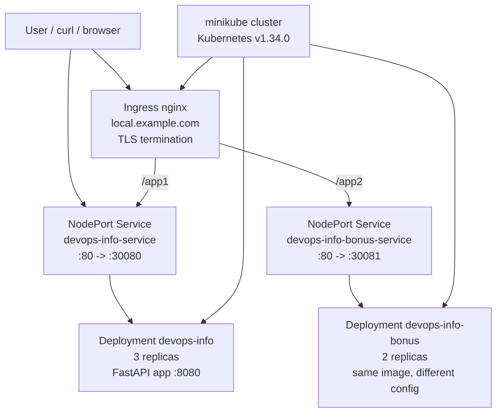
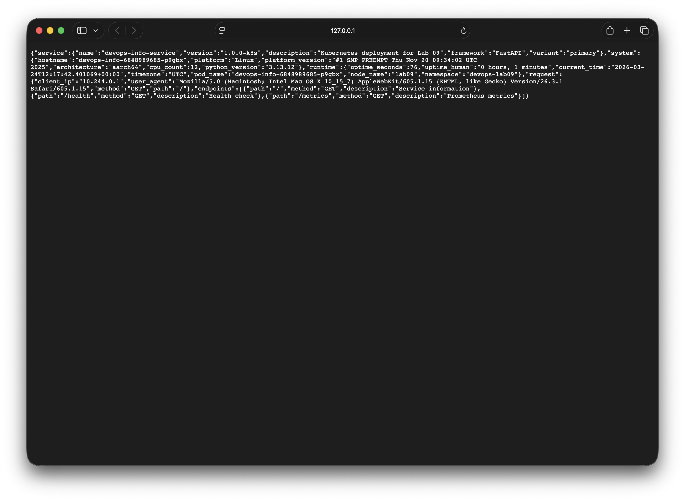

# LAB09 - Kubernetes Fundamentals

## 1. Architecture Overview



I used `minikube` with the Docker driver because it works well for single-node development, and includes a very simple `ingress` addon workflow. That made it a better fit for this lab than installing `kind` from scratch.

The base application runs as Deployment `devops-info` in namespace `devops-lab09` with 3 replicas behind NodePort Service `devops-info-service`. For the bonus task I deployed a second instance of the same image as `devops-info-bonus`, but with different environment variables so the response clearly identifies it as a second application. An nginx Ingress routes `/app1` to the first service and `/app2` to the second service, and TLS is terminated with a self-signed certificate stored in Kubernetes Secret `local-example-com-tls`.

Resource allocation strategy:

- Primary app: requests `100m` CPU / `128Mi` memory, limits `300m` CPU / `256Mi` memory
- Bonus app: requests `100m` CPU / `128Mi` memory, limits `250m` CPU / `256Mi` memory
- Rolling updates: `maxSurge: 1`, `maxUnavailable: 0`, `minReadySeconds: 5`

## 2. Manifest Files

### `k8s/namespace.yml`

Creates isolated namespace `devops-lab09` so all lab resources stay separate from `default`.

### `k8s/deployment.yml`

Primary Deployment for the Python FastAPI application.

Key choices:

- `replicas: 3` to satisfy the minimum requirement and demonstrate HA behavior
- `strategy.rollingUpdate.maxSurge: 1` and `maxUnavailable: 0` to preserve availability during updates
- readiness and liveness probes on `GET /health`
- explicit `requests` and `limits` for predictable scheduling
- pod security context pins `runAsUser: 100`, `runAsGroup: 101`, `runAsNonRoot: true`
- pod metadata uses labels under `app.kubernetes.io/*`

### `k8s/service.yml`

NodePort Service for the primary Deployment.

Key choices:

- `type: NodePort`
- service port `80`, target port `8080`
- static `nodePort: 30080` so the external mapping is deterministic

### `k8s/bonus-app2-deployment.yml`

Second Deployment for the bonus task. It uses the same image but different runtime config:

- `APP_NAME=devops-info-service-bonus`
- `APP_VERSION=2.0.0-k8s`
- `APP_VARIANT=bonus`

This makes the second app visibly different without maintaining a second codebase.

### `k8s/bonus-app2-service.yml`

NodePort Service for the second app with `nodePort: 30081`.

### `k8s/ingress.yml`

Ingress resource with:

- host `local.example.com`
- path `/app1` -> `devops-info-service`
- path `/app2` -> `devops-info-bonus-service`
- TLS via secret `local-example-com-tls`
- nginx rewrite annotation so `/app1` and `/app2` map cleanly to the app root

### `k8s/deployment-rollout-v2.yml`

Separate manifest used only for the rolling-update demonstration. It changes the pod template labels and environment:

- `app.kubernetes.io/version: v2`
- `APP_VERSION=1.1.0-k8s-rollout`
- `APP_VARIANT=primary-rollout-v2`

I kept this separate so the base `deployment.yml` stays the clean steady-state manifest.

## 3. Local Kubernetes Setup Evidence

### Tooling chosen

- `kubectl v1.35.0` client
- `minikube v1.37.0`
- local cluster profile: `lab09`

### Cluster startup evidence

```text
$ kubectl cluster-info
Kubernetes control plane is running at https://127.0.0.1:32776
CoreDNS is running at https://127.0.0.1:32776/api/v1/namespaces/kube-system/services/kube-dns:dns/proxy
```

```text
$ kubectl get nodes -o wide
NAME    STATUS   ROLES           AGE     VERSION   INTERNAL-IP    EXTERNAL-IP   OS-IMAGE             KERNEL-VERSION                        CONTAINER-RUNTIME
lab09   Ready    control-plane   7m40s   v1.34.0   192.168.58.2   <none>        Ubuntu 22.04.5 LTS   6.17.8-orbstack-00308-g8f9c941121b1   docker://28.4.0
```

```text
$ kubectl get namespaces
NAME              STATUS   AGE
default           Active   7m40s
devops-lab09      Active   5m25s
ingress-nginx     Active   6m37s
kube-node-lease   Active   7m40s
kube-public       Active   7m40s
kube-system       Active   7m40s
```

The image used for the Deployment comes from the Lab 2 Docker image lineage. For this lab I rebuilt the same application image from the current repository state as `luminitetime/devops-info-service-python:lab09` and loaded it into the minikube profile so the cluster ran the actual current code rather than an older registry tag.

## 4. Deployment Evidence

### Image build used for Kubernetes

```text
$ minikube image build -p lab09 -t luminitetime/devops-info-service-python:lab09 app_python
#12 naming to docker.io/luminitetime/devops-info-service-python:lab09 done
```

### Final cluster resources

```text
$ kubectl get all,ingress,secret -n devops-lab09
NAME                                   READY   STATUS    RESTARTS   AGE
pod/devops-info-6848989685-p9gbx       1/1     Running   0          2m7s
pod/devops-info-6848989685-x57db       1/1     Running   0          114s
pod/devops-info-6848989685-xrt4n       1/1     Running   0          102s
pod/devops-info-bonus-f45dc87f-n4vk2   1/1     Running   0          4m40s
pod/devops-info-bonus-f45dc87f-nwh7m   1/1     Running   0          4m52s

NAME                                TYPE       CLUSTER-IP      EXTERNAL-IP   PORT(S)        AGE
service/devops-info-bonus-service   NodePort   10.98.161.152   <none>        80:30081/TCP   5m23s
service/devops-info-service         NodePort   10.98.250.192   <none>        80:30080/TCP   5m23s

NAME                                READY   UP-TO-DATE   AVAILABLE   AGE
deployment.apps/devops-info         3/3     3            3           5m23s
deployment.apps/devops-info-bonus   2/2     2            2           5m23s

NAME                                            CLASS   HOSTS               ADDRESS        PORTS     AGE
ingress.networking.k8s.io/devops-info-ingress   nginx   local.example.com   192.168.58.2   80, 443   5m16s

NAME                           TYPE                DATA   AGE
secret/local-example-com-tls   kubernetes.io/tls   2      5m18s
```

### Pods and Services with detailed view

```text
$ kubectl get pods,svc -n devops-lab09 -o wide
NAME                                   READY   STATUS    RESTARTS   AGE     IP            NODE    NOMINATED NODE   READINESS GATES
pod/devops-info-6848989685-p9gbx       1/1     Running   0          2m11s   10.244.0.21   lab09   <none>           <none>
pod/devops-info-6848989685-x57db       1/1     Running   0          118s    10.244.0.22   lab09   <none>           <none>
pod/devops-info-6848989685-xrt4n       1/1     Running   0          106s    10.244.0.23   lab09   <none>           <none>
pod/devops-info-bonus-f45dc87f-n4vk2   1/1     Running   0          4m44s   10.244.0.14   lab09   <none>           <none>
pod/devops-info-bonus-f45dc87f-nwh7m   1/1     Running   0          4m56s   10.244.0.11   lab09   <none>           <none>

NAME                                TYPE       CLUSTER-IP      EXTERNAL-IP   PORT(S)        AGE     SELECTOR
service/devops-info-bonus-service   NodePort   10.98.161.152   <none>        80:30081/TCP   5m27s   app.kubernetes.io/component=api,app.kubernetes.io/name=devops-info-bonus
service/devops-info-service         NodePort   10.98.250.192   <none>        80:30080/TCP   5m27s   app.kubernetes.io/component=api,app.kubernetes.io/name=devops-info
```

### Endpoints selected by the Services

```text
$ kubectl get endpoints -n devops-lab09
NAME                        ENDPOINTS                                            AGE
devops-info-bonus-service   10.244.0.11:8080,10.244.0.14:8080                    5m27s
devops-info-service         10.244.0.21:8080,10.244.0.22:8080,10.244.0.23:8080   5m27s
```

### Deployment description

```text
$ kubectl describe deployment devops-info -n devops-lab09
Replicas:               3 desired | 3 updated | 3 total | 3 available | 0 unavailable
StrategyType:           RollingUpdate
RollingUpdateStrategy:  0 max unavailable, 1 max surge
...
Limits:
  cpu:     300m
  memory:  256Mi
Requests:
  cpu:      100m
  memory:   128Mi
Liveness:   http-get http://:http/health delay=15s timeout=2s period=10s #success=1 #failure=3
Readiness:  http-get http://:http/health delay=5s timeout=2s period=5s #success=1 #failure=3
```

### Service access verification

Because minikube uses the Docker driver on macOS, `minikube service --url` created localhost tunnels that had to stay open while testing:

```text
$ minikube service devops-info-service -n devops-lab09 --url -p lab09
http://127.0.0.1:61497

$ minikube service devops-info-bonus-service -n devops-lab09 --url -p lab09
http://127.0.0.1:61496
```

Primary app response:

```text
$ curl -s http://127.0.0.1:61497/ | jq '{service: .service, runtime: {pod_name: .runtime.pod_name, namespace: .runtime.namespace}}'
{
  "service": {
    "name": "devops-info-service",
    "version": "1.0.0-k8s",
    "description": "Kubernetes deployment for Lab 09",
    "framework": "FastAPI",
    "variant": "primary"
  },
  "runtime": {
    "pod_name": "devops-info-6848989685-r5h2m",
    "namespace": "devops-lab09"
  }
}
```

Bonus app response:

```text
$ curl -s http://127.0.0.1:61496/ | jq '{service: .service, runtime: {pod_name: .runtime.pod_name, namespace: .runtime.namespace}}'
{
  "service": {
    "name": "devops-info-service-bonus",
    "version": "2.0.0-k8s",
    "description": "Bonus ingress target for Lab 09",
    "framework": "FastAPI",
    "variant": "bonus"
  },
  "runtime": {
    "pod_name": "devops-info-bonus-f45dc87f-n4vk2",
    "namespace": "devops-lab09"
  }
}
```

Health endpoint:

```text
$ curl -s http://127.0.0.1:61497/health
{"status":"healthy","timestamp":"2026-03-24T12:14:41.193111+00:00","uptime_seconds":60}
```

Metrics endpoint:

```text
$ curl -s http://127.0.0.1:61497/metrics | sed -n '1,20p'
# HELP python_gc_objects_collected_total Objects collected during gc
# TYPE python_gc_objects_collected_total counter
python_gc_objects_collected_total{generation="0"} 468.0
python_gc_objects_collected_total{generation="1"} 16.0
python_gc_objects_collected_total{generation="2"} 0.0
...
# HELP python_info Python platform information
# TYPE python_info gauge
python_info{implementation="CPython",major="3",minor="13",patchlevel="12",version="3.13.12"} 1.0
```

### Screenshots

Primary NodePort page:



Bonus NodePort page:


## 5. Operations Performed

### Commands used

```bash
minikube start --driver=docker --profile lab09 --cpus=4 --memory=8192
minikube addons enable ingress -p lab09
minikube image build -p lab09 -t luminitetime/devops-info-service-python:lab09 app_python

kubectl apply -f k8s/namespace.yml
kubectl apply -f k8s/deployment.yml -f k8s/service.yml
kubectl apply -f k8s/bonus-app2-deployment.yml -f k8s/bonus-app2-service.yml

openssl req -x509 -nodes -days 365 -newkey rsa:2048 \
  -keyout /tmp/lab09-tls/tls.key -out /tmp/lab09-tls/tls.crt \
  -subj "/CN=local.example.com/O=local.example.com"

kubectl create secret tls local-example-com-tls \
  --namespace devops-lab09 \
  --key /tmp/lab09-tls/tls.key \
  --cert /tmp/lab09-tls/tls.crt \
  --dry-run=client -o yaml | kubectl apply -f -

kubectl apply -f k8s/ingress.yml
```

### Scaling demonstration

I scaled the primary Deployment up to 5 replicas imperatively, verified all five became available, then restored the base manifest state.

```text
$ kubectl scale deployment/devops-info -n devops-lab09 --replicas=5
deployment.apps/devops-info scaled

$ kubectl rollout status deployment/devops-info -n devops-lab09 --timeout=180s
deployment "devops-info" successfully rolled out

$ kubectl get deployment devops-info -n devops-lab09
NAME          READY   UP-TO-DATE   AVAILABLE   AGE
devops-info   5/5     5            5           2m11s
```

Load-balanced traffic during the 5-replica state:

```text
$ for i in {1..10}; do curl -s http://127.0.0.1:61497/ | jq -r '.runtime.pod_name'; done | sort -u
devops-info-6848989685-bkmvj
devops-info-6848989685-m5mvs
devops-info-6848989685-r5h2m
devops-info-6848989685-shk97
```

### Rolling update demonstration

I applied `k8s/deployment-rollout-v2.yml`, which changed the pod template and triggered revision 3.

```text
$ kubectl apply -f k8s/deployment-rollout-v2.yml
deployment.apps/devops-info configured

$ kubectl rollout history deployment/devops-info -n devops-lab09
deployment.apps/devops-info
REVISION  CHANGE-CAUSE
1         <none>
3         <none>
4         <none>
```

Revision 3 details:

```text
$ kubectl rollout history deployment/devops-info -n devops-lab09 --revision=3
...
APP_DESCRIPTION: Kubernetes deployment for Lab 09 rollout v2
APP_VERSION:     1.1.0-k8s-rollout
APP_VARIANT:     primary-rollout-v2
```

Live traffic during rollout stayed at HTTP 200 the whole time, while responses gradually switched from v1 pods to v2 pods:

```text
15:15:47 status=200 version=1.0.0-k8s variant=primary pod=devops-info-6848989685-bkmvj
15:15:52 status=200 version=1.1.0-k8s-rollout variant=primary-rollout-v2 pod=devops-info-698c65b9f5-pvph7
15:15:55 status=200 version=1.1.0-k8s-rollout variant=primary-rollout-v2 pod=devops-info-698c65b9f5-pvph7
15:16:00 status=200 version=1.1.0-k8s-rollout variant=primary-rollout-v2 pod=devops-info-698c65b9f5-ffqcj
```

After the rollout completed:

```text
$ curl -s http://127.0.0.1:61497/ | jq '{service: .service, runtime: {pod_name: .runtime.pod_name}}'
{
  "service": {
    "name": "devops-info-service",
    "version": "1.1.0-k8s-rollout",
    "description": "Kubernetes deployment for Lab 09 rollout v2",
    "framework": "FastAPI",
    "variant": "primary-rollout-v2"
  },
  "runtime": {
    "pod_name": "devops-info-698c65b9f5-tvcw6"
  }
}
```

### Rollback demonstration

I rolled the Deployment back with `kubectl rollout undo`, which created revision 4 and restored the v1 template.

```text
$ kubectl rollout undo deployment/devops-info -n devops-lab09
deployment.apps/devops-info rolled back

$ kubectl rollout history deployment/devops-info -n devops-lab09 --revision=4
...
APP_DESCRIPTION: Kubernetes deployment for Lab 09
APP_VERSION:     1.0.0-k8s
APP_VARIANT:     primary
```

Live traffic during rollback also stayed healthy while old and new ReplicaSets overlapped:

```text
15:16:32 status=200 version=1.1.0-k8s-rollout variant=primary-rollout-v2 pod=devops-info-698c65b9f5-ffqcj
15:16:34 status=200 version=1.0.0-k8s variant=primary pod=devops-info-6848989685-p9gbx
15:16:35 status=200 version=1.0.0-k8s variant=primary pod=devops-info-6848989685-p9gbx
15:16:36 status=200 version=1.1.0-k8s-rollout variant=primary-rollout-v2 pod=devops-info-698c65b9f5-pvph7
```

Final steady-state after rollback:

```text
$ kubectl get deployment devops-info -n devops-lab09
NAME          READY   UP-TO-DATE   AVAILABLE   AGE
devops-info   3/3     3            3           3m56s
```

## 6. Bonus Task - Ingress with TLS

### Ingress controller enabled

```text
$ kubectl get pods -n ingress-nginx -o wide
NAME                                       READY   STATUS      RESTARTS   AGE     IP           NODE
ingress-nginx-admission-create-t6km8       0/1     Completed   0          6m41s   10.244.0.4   lab09
ingress-nginx-admission-patch-4j4z8        0/1     Completed   0          6m41s   10.244.0.3   lab09
ingress-nginx-controller-9cc49f96f-mqj6v   1/1     Running     0          6m41s   10.244.0.5   lab09
```

### TLS certificate evidence

```text
$ openssl x509 -in /tmp/lab09-tls/tls.crt -noout -subject -issuer -dates
subject=CN=local.example.com, O=local.example.com
issuer=CN=local.example.com, O=local.example.com
notBefore=Mar 24 12:13:10 2026 GMT
notAfter=Mar 24 12:13:10 2027 GMT
```

### Ingress behavior

HTTP correctly redirects to HTTPS:

```text
$ curl -I -H 'Host: local.example.com' http://192.168.58.2/app1
HTTP/1.1 308 Permanent Redirect
Location: https://local.example.com/app1
```

HTTPS route to app1:

```text
$ curl -sk --resolve local.example.com:443:192.168.58.2 https://local.example.com/app1 | jq '{service: .service, runtime: {pod_name: .runtime.pod_name, namespace: .runtime.namespace}}'
{
  "service": {
    "name": "devops-info-service",
    "version": "1.0.0-k8s",
    "description": "Kubernetes deployment for Lab 09",
    "framework": "FastAPI",
    "variant": "primary"
  },
  "runtime": {
    "pod_name": "devops-info-6848989685-x57db",
    "namespace": "devops-lab09"
  }
}
```

HTTPS route to app2:

```text
$ curl -sk --resolve local.example.com:443:192.168.58.2 https://local.example.com/app2 | jq '{service: .service, runtime: {pod_name: .runtime.pod_name, namespace: .runtime.namespace}}'
{
  "service": {
    "name": "devops-info-service-bonus",
    "version": "2.0.0-k8s",
    "description": "Bonus ingress target for Lab 09",
    "framework": "FastAPI",
    "variant": "bonus"
  },
  "runtime": {
    "pod_name": "devops-info-bonus-f45dc87f-nwh7m",
    "namespace": "devops-lab09"
  }
}
```

I validated ingress with `curl --resolve` instead of editing `/etc/hosts`, so the host header and TLS SNI still matched `local.example.com` without needing elevated system changes.

### Why Ingress is better than direct NodePort

- single HTTP/HTTPS entry point instead of remembering multiple high ports
- path-based routing lets one hostname front multiple services
- TLS termination is centralized
- easier to evolve later into production patterns such as cert-manager, external DNS, or Gateway API

## 7. Production Considerations

### Health checks

Both liveness and readiness probes use `GET /health`.

Why this is acceptable here:

- the service is stateless
- there are no external dependencies such as a database
- readiness only needs to confirm the HTTP process is ready to serve traffic

In a larger app I would split readiness from liveness, for example:

- liveness: only check process health
- readiness: check dependencies, configuration load, and background startup completion

### Resource limits rationale

- `100m` / `128Mi` requests are enough for a tiny FastAPI service and prevent overscheduling
- `300m` / `256Mi` limits give headroom for request bursts while still constraining runaway containers
- the bonus app got a slightly lower CPU limit because it has identical code and lower importance for the lab

### Security and hardening choices

- image already runs as non-root user `app`
- manifests additionally pin numeric UID/GID (`100:101`)
- `allowPrivilegeEscalation: false`
- all Linux capabilities dropped
- seccomp profile set to `RuntimeDefault`

### How I would improve this for production

- use dedicated readiness endpoint
- add HorizontalPodAutoscaler instead of only manual scaling
- store image in a registry with immutable digests
- manage certs with cert-manager rather than self-signed manual secret creation
- add NetworkPolicies
- switch from Ingress to Gateway API for future-proof traffic management
- add metrics, logs, and tracing to the cluster itself, not only the app

### Monitoring and observability strategy

This app already exposes `/metrics` from Lab 8, so the natural next step would be:

- Prometheus scrape config for `devops-info-service`
- Grafana dashboards for request rate, errors, duration, and pod restarts
- Loki or another log backend for container logs
- alerts for probe failures, crash loops, and high latency

## 8. Challenges & Solutions

### 1. `CreateContainerConfigError` on first Deployment attempt

Issue:

- Kubernetes refused to start the pods with `runAsNonRoot` because the image user was named `app` instead of a numeric UID.

Evidence:

```text
Error: container has runAsNonRoot and image has non-numeric user (app), cannot verify user is non-root
```

How I debugged it:

- `kubectl describe pod ...`
- `docker run --rm devops-info-service-python:lab09 sh -c 'id -u app && id -g app && getent passwd app'`

Result:

```text
100
101
app:x:100:101::/nonexistent:/usr/sbin/nologin
```

Fix:

- pinned `runAsUser: 100` and `runAsGroup: 101` in both Deployment manifests

### 2. `kubectl rollout status` briefly reported success before the rollout fully converged

What I learned:

- for a reliable lab solution it is worth checking ReplicaSets and live traffic too, not only trusting one command blindly =)
- `kubectl get rs`, `kubectl get pods`, and actual curl traffic gave a more accurate view of the in-progress state

### 3. Ingress host testing on local macOS

Issue:

- browser-friendly hostname testing usually wants `/etc/hosts`, but I wanted to avoid system-level changes

Fix:

- tested HTTPS with `curl --resolve local.example.com:443:192.168.58.2`

### What I learned about Kubernetes

- declarative manifests are easier to reason about than imperative commands once the workload gets more complex
- Deployment rollout behavior is much easier to understand when you watch ReplicaSets and readiness together
- labels/selectors are the glue between Deployments, Services, and Ingress
- Kubernetes security context details matter even when the container image is already configured correctly
