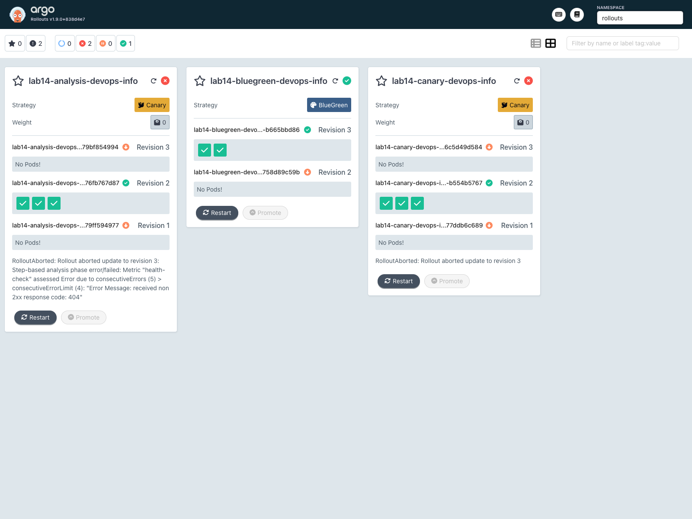
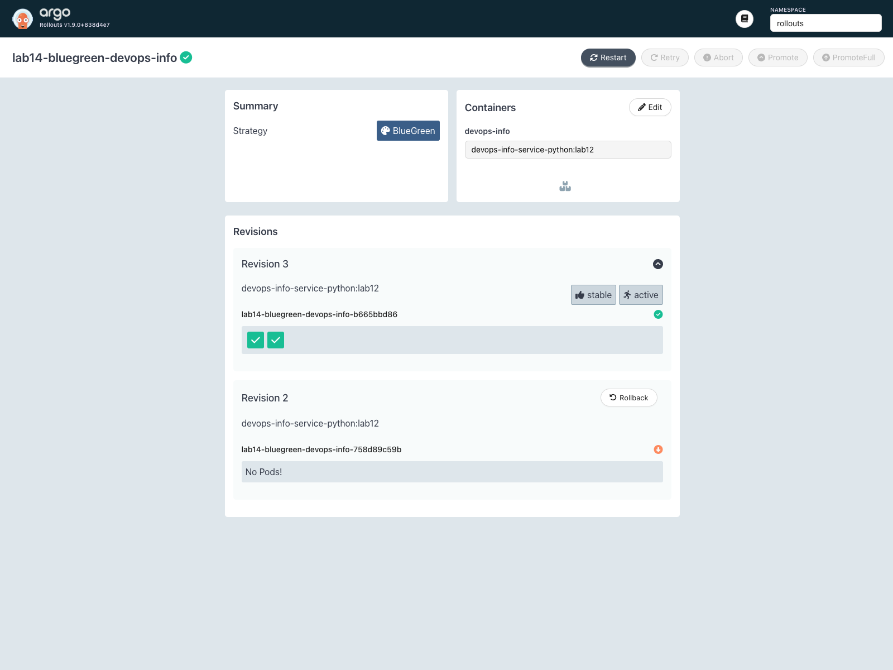

# LAB14 - Progressive Delivery with Argo Rollouts

## 1. Argo Rollouts Setup

Argo Rollouts controller, dashboard, and CLI plugin were installed in the `argo-rollouts` namespace.

```text
$ kubectl argo rollouts version
kubectl-argo-rollouts: v1.9.0+838d4e7
  BuildDate: 2026-03-20T21:11:48Z
  GitCommit: 838d4e792be666ec11bd0c80331e0c5511b5010e
  Platform: darwin/arm64
```

```text
$ kubectl get pods,svc -n argo-rollouts
NAME                                           READY   STATUS    RESTARTS   AGE
pod/argo-rollouts-79b89d8856-mqzwq             1/1     Running   0          11s
pod/argo-rollouts-dashboard-7b7bf46775-vmb5v   1/1     Running   0          14s

NAME                              TYPE        CLUSTER-IP      EXTERNAL-IP   PORT(S)    AGE
service/argo-rollouts-dashboard   ClusterIP   10.102.195.66   <none>        3100/TCP   14s
service/argo-rollouts-metrics     ClusterIP   10.108.33.59    <none>        8090/TCP   11s
```

Dashboard access used local port-forwarding:

```text
$ kubectl port-forward svc/argo-rollouts-dashboard -n argo-rollouts 3100:3100
Forwarding from 127.0.0.1:3100 -> 3100
```

## 2. Rollout vs Deployment

The chart now contains `templates/rollout.yaml` and keeps `deployment.yaml` only as a fallback template for non-rollout rendering.

Key differences:

- `Deployment` performs regular rolling updates
- `Rollout` adds canary and blue-green strategies
- `Rollout` supports manual promotion, abort, undo, preview services, and analysis runs
- `Rollout` status contains step progress and stable/canary role information

Additional chart changes:

- `templates/service.yaml` creates the preview service for blue-green mode
- `templates/analysis-template.yaml` creates the bonus `AnalysisTemplate`
- values files were added for canary, blue-green, and analysis scenarios

## 3. Canary Deployment

The canary release was installed as `lab14-canary` in namespace `rollouts`.

Initial rollout resource:

```text
$ kubectl get rollout,svc -n rollouts | rg 'lab14-canary|NAME'
NAME                                           DESIRED   CURRENT   UP-TO-DATE   AVAILABLE   AGE
rollout.argoproj.io/lab14-canary-devops-info   3         3         3            2           15s

NAME                               TYPE        CLUSTER-IP      EXTERNAL-IP   PORT(S)   AGE
service/lab14-canary-devops-info   ClusterIP   10.107.205.89   <none>        80/TCP    15s
```

### Manual first step

After upgrading the release, the Rollout paused at the first manual gate. With 3 desired replicas, the requested 20% weight became an actual 25% pod split.

```text
$ kubectl argo rollouts get rollout lab14-canary-devops-info -n rollouts
Name:            lab14-canary-devops-info
Namespace:       rollouts
Status:          ॥ Paused
Message:         CanaryPauseStep
Strategy:        Canary
  Step:          1/9
  SetWeight:     20
  ActualWeight:  25
```

Promotion command:

```text
$ kubectl argo rollouts promote lab14-canary-devops-info -n rollouts
rollout 'lab14-canary-devops-info' promoted
```

### Automatic progression

After the first manual promotion, the remaining timed pauses progressed automatically.

Observed intermediate steps:

```text
Step 3/9  SetWeight 40  ActualWeight 33  Status Paused
Step 5/9  SetWeight 60  ActualWeight 66  Status Paused
...
$ kubectl argo rollouts status lab14-canary-devops-info -n rollouts --timeout 180s
Healthy
```

### Abort / rollback

A second canary update was started and aborted at the first pause step.

```text
$ kubectl argo rollouts abort lab14-canary-devops-info -n rollouts
rollout 'lab14-canary-devops-info' aborted
```

Result after abort:

```text
$ kubectl argo rollouts get rollout lab14-canary-devops-info -n rollouts
Name:            lab14-canary-devops-info
Namespace:       rollouts
Status:          ✖ Degraded
Message:         RolloutAborted: Rollout aborted update to revision 3
Strategy:        Canary
  Step:          0/9
  SetWeight:     0
  ActualWeight:  0
Images:          devops-info-service-python:lab12 (stable)
Replicas:
  Desired:       3
  Current:       3
  Updated:       0
  Ready:         3
  Available:     3
```

This demonstrates the main canary advantage: the in-progress version can be stopped before full promotion.

## 4. Blue-Green Deployment

The blue-green release was installed as `lab14-bluegreen`.

The initial install used Helm. For the version-switch test, the Rollout template was updated directly after Helm 4 reported apply conflicts on the controller-managed service selectors. This kept the live blue-green workflow under Argo Rollouts control instead of forcing service recreation.

Services created by the chart:

```text
$ kubectl get rollout,svc -n rollouts | rg 'lab14-bluegreen|NAME'
NAME                                              DESIRED   CURRENT   UP-TO-DATE   AVAILABLE   AGE
rollout.argoproj.io/lab14-bluegreen-devops-info   2         2         2            2           18s

NAME                                          TYPE        CLUSTER-IP       EXTERNAL-IP   PORT(S)   AGE
service/lab14-bluegreen-devops-info           ClusterIP   10.101.187.150   <none>        80/TCP    18s
service/lab14-bluegreen-devops-info-preview   ClusterIP   10.110.140.110   <none>        80/TCP    18s
```

### Preview vs active

Before promotion, the active service still served the old version while the preview service exposed the new version.

```text
$ curl -sS http://127.0.0.1:18083/ | jq '.service.version, .service.description'
"1.0.0-blue"
"Blue-green rollout release"

$ curl -sS http://127.0.0.1:18084/ | jq '.service.version, .service.description'
"1.1.0-green"
"Blue-green rollout preview revision"
```

Rollout state at this moment:

```text
$ kubectl argo rollouts get rollout lab14-bluegreen-devops-info -n rollouts
Name:            lab14-bluegreen-devops-info
Namespace:       rollouts
Status:          ॥ Paused
Message:         BlueGreenPause
Strategy:        BlueGreen
Images:          devops-info-service-python:lab12 (active, preview, stable)
```

### Promotion

```text
$ kubectl argo rollouts promote lab14-bluegreen-devops-info -n rollouts
rollout 'lab14-bluegreen-devops-info' promoted

$ kubectl argo rollouts status lab14-bluegreen-devops-info -n rollouts --timeout 180s
Healthy
```

Active service after promotion:

```text
$ curl -sS http://127.0.0.1:18085/ | jq '.service.version, .service.description'
"1.1.0-green"
"Blue-green rollout preview revision"
```

### Instant rollback

Rollback used the dedicated `undo` command:

```text
$ kubectl argo rollouts undo lab14-bluegreen-devops-info -n rollouts
rollout 'lab14-bluegreen-devops-info' undo

$ kubectl argo rollouts status lab14-bluegreen-devops-info -n rollouts --timeout 180s
Healthy
```

Active service after rollback:

```text
$ curl -sS http://127.0.0.1:18086/ | jq '.service.version, .service.description'
"1.0.0-blue"
"Blue-green rollout release"
```

The rollback was effectively instant because traffic switched by changing service selectors instead of gradually replacing all pods.

## 5. Strategy Comparison

| Aspect | Canary | Blue-Green |
|--------|--------|------------|
| Traffic movement | gradual | instant |
| Safety model | partial exposure before full rollout | full preview before switch |
| Rollback speed | fast, but step-based | immediate |
| Extra resources | lower | higher |
| Best fit | user-facing services needing cautious rollout | changes that need a full preview environment |

Recommendation:

- use canary when gradual exposure is important
- use blue-green when quick switch and quick rollback matter more than extra temporary capacity

## 6. CLI Commands Used

```text
kubectl argo rollouts get rollout <name> -n rollouts
kubectl argo rollouts status <name> -n rollouts --timeout 180s
kubectl argo rollouts promote <name> -n rollouts
kubectl argo rollouts abort <name> -n rollouts
kubectl argo rollouts undo <name> -n rollouts
```

## 7. Bonus - Automated Analysis

The chart creates `templates/analysis-template.yaml` when analysis is enabled. The template checks the application health endpoint through the in-cluster service and evaluates `$.status`.

Created template:

```text
$ kubectl get analysistemplate -n rollouts | rg 'lab14-analysis|NAME'
NAME                                AGE
lab14-analysis-devops-info-health   9s
```

### Successful analysis

With `path: /health`, the analysis step completed successfully during the canary rollout.

```text
$ kubectl get analysisrun -n rollouts | rg 'lab14-analysis|NAME'
NAME                                        STATUS       AGE
lab14-analysis-devops-info-76fb767d87-2-2   Successful   2m33s
```

```text
$ kubectl argo rollouts get rollout lab14-analysis-devops-info -n rollouts
...
│  └──α lab14-analysis-devops-info-76fb767d87-2-2       AnalysisRun  ✔ Successful  2m33s  ✔ 3
```

### Failed analysis and auto-abort

The failing scenario changed the analysis URL to `/does-not-exist`. The web metric received repeated HTTP 404 responses, the `AnalysisRun` entered `Error`, and the rollout was aborted automatically.

```text
$ kubectl describe analysisrun lab14-analysis-devops-info-79bf854994-3-2 -n rollouts
Message:  Metric "health-check" assessed Error due to consecutiveErrors (5) > consecutiveErrorLimit (4): "Error Message: received non 2xx response code: 404"
...
Events:
  Warning  MetricError       ...  Metric 'health-check' Completed. Result: Error
  Warning  AnalysisRunError  ...  Analysis Completed. Result: Error
```

Final rollout state:

```text
$ kubectl argo rollouts get rollout lab14-analysis-devops-info -n rollouts
Name:            lab14-analysis-devops-info
Namespace:       rollouts
Status:          ✖ Degraded
Message:         RolloutAborted: Rollout aborted update to revision 3: Step-based analysis phase error/failed: Metric "health-check" assessed Error due to consecutiveErrors (5) > consecutiveErrorLimit (4): "Error Message: received non 2xx response code: 404"
...
│  └──α lab14-analysis-devops-info-79bf854994-3-2       AnalysisRun  ⚠ Error       50s    ⚠ 5
```

This confirms that the analysis step can gate promotion automatically and stop the rollout when the metric fails.

## 8. Screenshots

Rollouts dashboard:



Blue-green details:


