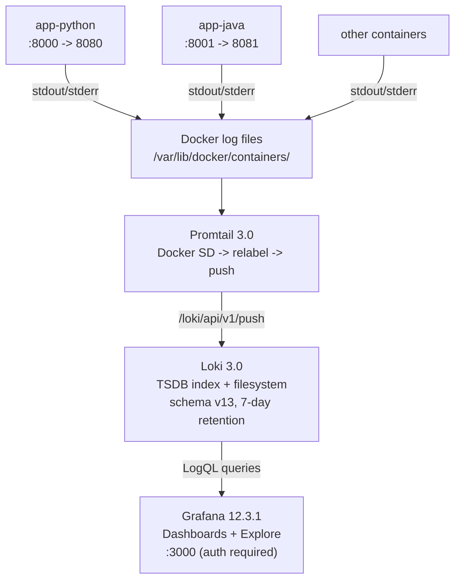
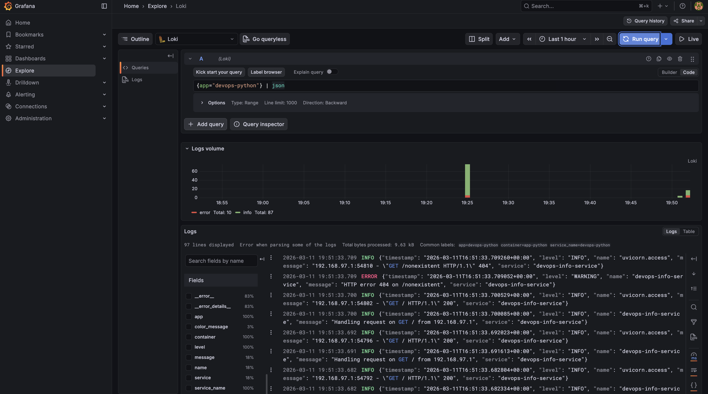
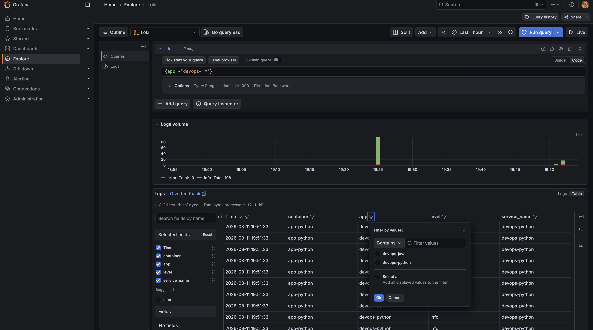
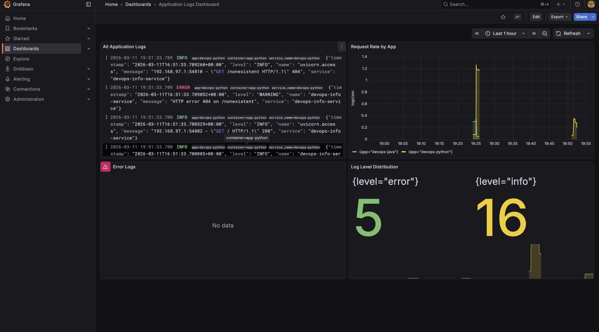
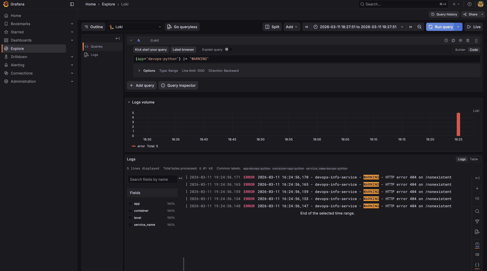
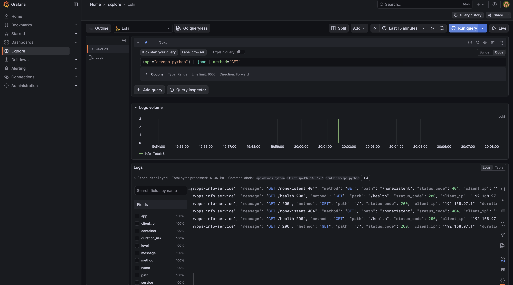
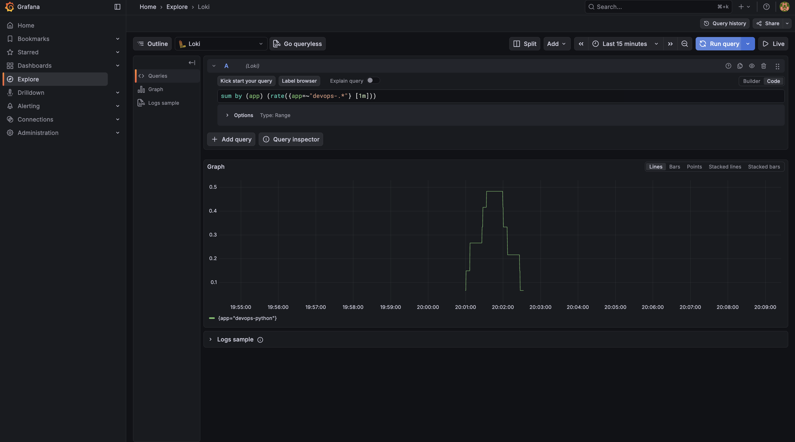
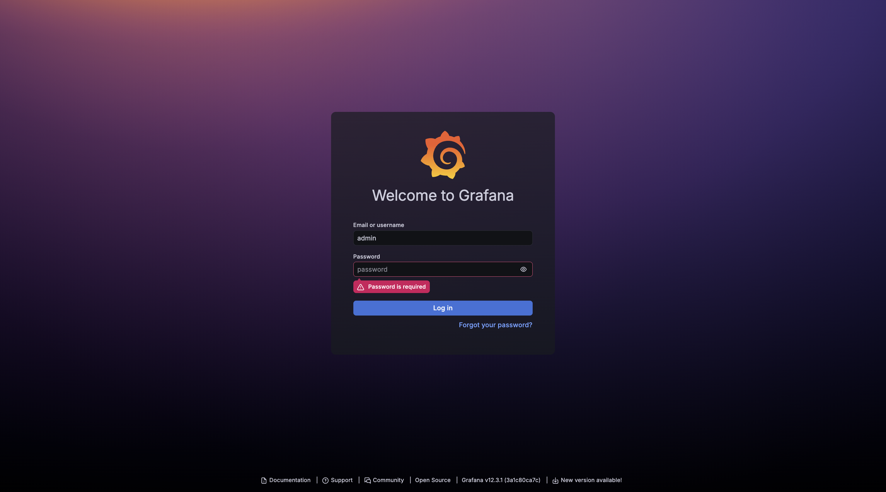
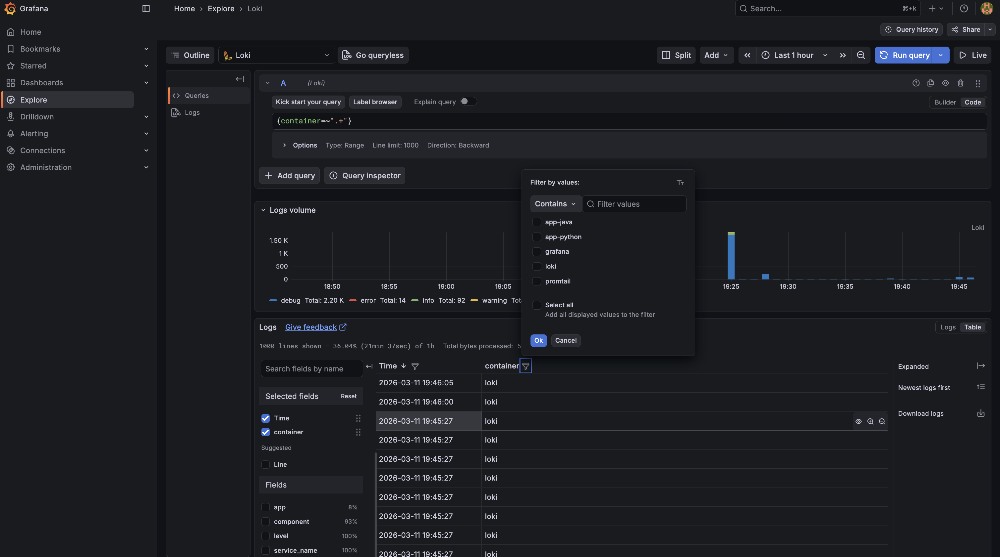
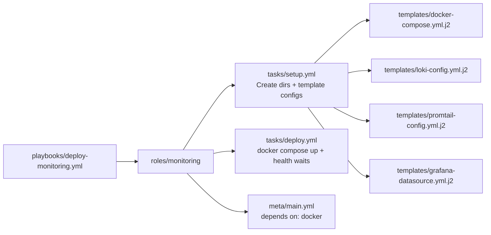

# LAB07 - Observability and Logging with Loki Stack

## 1. Architecture



All services share a `logging` bridge network. Promtail discovers containers via the Docker socket and only scrapes those with label `logging=promtail`.

### Key concepts

**How is Loki different from Elasticsearch?**
Loki indexes only labels (metadata), not the full log content. This makes ingestion much cheaper and faster. Elasticsearch builds a full-text inverted index over every log line, which gives richer search but at significantly higher storage and compute cost. For most DevOps use cases, label-based selection plus grep-style filtering (LogQL) is sufficient.

**What are log labels and why do they matter?**
Labels are key-value pairs attached to each log stream (e.g., `app="devops-python"`, `container="app-python"`). Loki uses labels as the primary index -- every unique label combination creates a separate stream. Queries always start with a label selector (`{app="devops-python"}`), so well-chosen labels dramatically improve query performance.

**How does Promtail discover containers?**
Promtail uses Docker service discovery (`docker_sd_configs`) via the Docker socket. It lists running containers, reads their labels and log file paths, then tails the log files. Relabeling rules extract useful metadata (container name, custom labels) into Loki labels.

## 2. Setup Guide

### Prerequisites

- Docker Engine with Compose v2 plugin
- Ports 3000, 3100, 8000, 8001 available

### Deployment

```bash
cd monitoring

# Create .env for Grafana credentials (do NOT commit)
cat > .env <<'EOF'
GF_ADMIN_USER=admin
GF_ADMIN_PASSWORD=<your-password>
EOF

docker compose up -d
docker compose ps
```

### Verification

```bash
curl http://localhost:3100/ready       # "ready"
curl http://localhost:3000/api/health  # {"database":"ok",...}
curl http://localhost:8000/health      # {"status":"healthy",...}
curl http://localhost:8001/health      # {"status":"healthy",...}
```

### Teardown

```bash
cd monitoring
docker compose down -v
```

## 3. Configuration

### Loki (`loki/config.yml`)

Key choices:
- `auth_enabled: false` -- single-tenant development setup.
- `schema v13` with `tsdb` index store -- Loki 3.0 default, up to 10x faster queries and better compression than BoltDB shipper.
- `filesystem` object store -- suitable for single-instance; production would use S3/GCS.
- `retention_period: 168h` (7 days) with compactor enabled.

```yaml
schema_config:
  configs:
    - from: "2024-01-01"
      store: tsdb
      object_store: filesystem
      schema: v13
      index:
        prefix: index_
        period: 24h

limits_config:
  retention_period: 168h
```

### Promtail (`promtail/config.yml`)

- Uses `docker_sd_configs` to auto-discover containers via the Docker socket.
- Filter: only containers with label `logging=promtail` are scraped.
- Relabeling extracts `container` name (stripping leading `/`) and copies `app` and `component` labels from Docker labels.

```yaml
scrape_configs:
  - job_name: docker
    docker_sd_configs:
      - host: unix:///var/run/docker.sock
        refresh_interval: 5s
        filters:
          - name: label
            values: ["logging=promtail"]
    relabel_configs:
      - source_labels: ["__meta_docker_container_name"]
        regex: "/?(.*)"
        target_label: "container"
      - source_labels: ["__meta_docker_container_label_app"]
        target_label: "app"
```

### Grafana datasource

Provisioned automatically via `grafana/provisioning/datasources/loki.yml` -- no manual UI configuration needed.

## 4. Application Logging

The Python app (`app_python/app.py`) already implements JSON structured logging using `python-json-logger`:

```python
class _AppJsonFormatter(JsonFormatter):
    def add_fields(self, log_record, record, message_dict):
        super().add_fields(log_record, record, message_dict)
        log_record["timestamp"] = datetime.now(timezone.utc).isoformat()
        log_record["level"] = record.levelname
        log_record["service"] = APP_NAME
```

Sample JSON log line:

```json
{"timestamp": "2026-03-11T16:24:42+00:00", "level": "INFO", "service": "devops-info-service", "message": "Handling request on GET / from 192.168.97.1"}
```

Logged events: application startup, every HTTP request (method, path, client IP), HTTP errors (404, 422), unhandled exceptions.





## 5. Dashboard

The dashboard is auto-provisioned from `grafana/provisioning/dashboards/app-logs.json` and contains 4 panels:



### Panel 1 -- All Application Logs (Logs visualization)

```logql
{app=~"devops-.*"}
```

Shows recent log lines from both Python and Java apps with timestamps, labels, and full message text.

### Panel 2 -- Request Rate by App (Time series)

```logql
sum by (app) (rate({app=~"devops-.*"} [1m]))
```

Displays logs-per-second for each app as separate time series lines, useful for spotting traffic spikes.

### Panel 3 -- Error Logs (Logs visualization)

```logql
{app=~"devops-.*"} |= "ERROR" or {app=~"devops-.*"} |= "error"
```

Filters for error-level log lines only. Catches both uppercase (Python JSON formatter) and lowercase (Java/Spring) patterns.

### Panel 4 -- Log Level Distribution (Stat)

```logql
sum by (level) (count_over_time({app=~"devops-.*"} | json [5m]))
```

Parses JSON logs and aggregates count by level over 5-minute windows. Shows at-a-glance ratio of INFO vs ERROR vs WARNING.

### LogQL queries tested in Explore

**Query 1** -- filter errors from the Python app:

```logql
{app="devops-python"} |= "WARNING"
```



**Query 2** -- parse JSON and filter by HTTP method:

```logql
{app="devops-python"} | json | method="GET"
```



**Query 3** -- request rate metric across all apps:

```logql
sum by (app) (rate({app=~"devops-.*"} [1m]))
```



Additional queries used during testing:

```logql
{app="devops-java"} |= "Started"
{component=~"loki|promtail|grafana"}
rate({app="devops-python"} |= "404" [5m])
```

## 6. Production Configuration

### Resource limits

Every service has CPU and memory limits via `deploy.resources`:

| Service    | CPU limit | Memory limit | CPU reservation | Memory reservation |
|------------|-----------|-------------|-----------------|-------------------|
| Loki       | 1.0       | 1G          | 0.25            | 256M              |
| Promtail   | 0.5       | 512M        | 0.1             | 128M              |
| Grafana    | 1.0       | 1G          | 0.25            | 256M              |
| app-python | 0.5       | 256M        | 0.1             | 64M               |
| app-java   | 1.0       | 512M        | 0.25            | 256M              |

### Security

- `GF_AUTH_ANONYMOUS_ENABLED=false` -- anonymous access disabled; login required.
- Admin credentials supplied via `.env` file (gitignored).
- Docker socket mounted read-only for Promtail (`:ro`).



### Health checks

- Loki: `wget --spider http://localhost:3100/ready` every 10s, 15s start period.
- Grafana: `wget --spider http://localhost:3000/api/health` every 10s, 15s start period.
- Promtail depends on Loki health (`service_healthy` condition).

### Retention

7-day retention enforced by Loki's compactor running every 10 minutes.

## 7. Testing

### Deploy and verify

```text
$ docker compose ps
NAME         IMAGE                                COMMAND     STATUS                    PORTS
app-java     luminitetime/...-java:latest         ...         Up 4 minutes              :8001->8081
app-python   luminitetime/...-python:latest       ...         Up 4 minutes              :8000->8080
grafana      grafana/grafana:12.3.1               /run.sh     Up 32 seconds (healthy)   :3000->3000
loki         grafana/loki:3.0.0                   ...         Up 4 minutes (healthy)    :3100->3100
promtail     grafana/promtail:3.0.0               ...         Up 3 minutes
```

### Loki readiness

```text
$ curl http://localhost:3100/ready
ready
```

### Log query via API

```text
$ curl 'http://localhost:3100/loki/api/v1/query?query={app="devops-python"}&limit=2'
{"status":"success","data":{"resultType":"streams","result":[...]}}
```

### Anonymous access blocked

```text
$ curl -s -o /dev/null -w "%{http_code}" http://localhost:3000/api/search
401
```

### Logs from 3+ containers in Grafana Explore



### Generate test traffic

```bash
for i in {1..20}; do curl -s http://localhost:8000/ > /dev/null; done
for i in {1..20}; do curl -s http://localhost:8000/health > /dev/null; done
for i in {1..10}; do curl -s http://localhost:8001/ > /dev/null; done
for i in {1..5}; do curl -s http://localhost:8000/nonexistent > /dev/null; done
```

## 8. Challenges

- **Loki 3.0 config changes**: the `common` section and TSDB storage are new in 3.0 and not all online examples reflect this. Used the official Loki 3.0 configuration reference to get the correct schema and storage config.
- **Promtail Docker SD filtering**: early versions collected all container logs. Added `filters` with `label` matching `logging=promtail` to limit collection to labeled containers only.
- **Grafana datasource UID in dashboard JSON**: provisioned dashboards reference datasource by type (`"type": "loki"`) with empty UID, which Grafana resolves to the default Loki datasource automatically.
- **Java app port**: the Spring Boot image listens on 8081, not 8080. Mapped `8001:8081` in the compose file.

## Bonus -- Ansible Automation

### Role structure



### Parameterized variables (excerpt)

```yaml
monitoring_dir: /opt/monitoring
monitoring_loki_version: "3.0.0"
monitoring_grafana_version: "12.3.1"
monitoring_loki_retention_period: "168h"
monitoring_loki_schema_version: "v13"
monitoring_grafana_admin_user: admin
monitoring_grafana_admin_password: "{{ vault_grafana_admin_password | default('admin') }}"
```

### Playbook

```yaml
- name: Deploy monitoring stack
  hosts: webservers
  become: true
  roles:
    - role: monitoring
      tags: [monitoring]
```

### Lint result

```text
$ ansible-lint roles/monitoring/ playbooks/deploy-monitoring.yml
Passed: 0 failure(s), 0 warning(s) in 11 files. Last profile: production.
```

### Idempotency

The role uses `ansible.builtin.template` (only changes on file diff) and `docker compose up -d` (only recreates changed containers). Running twice produces zero changes on the template tasks; the compose task is marked changed only when containers are pulled or recreated.
