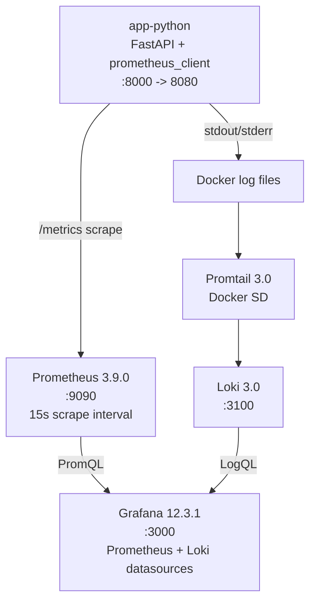
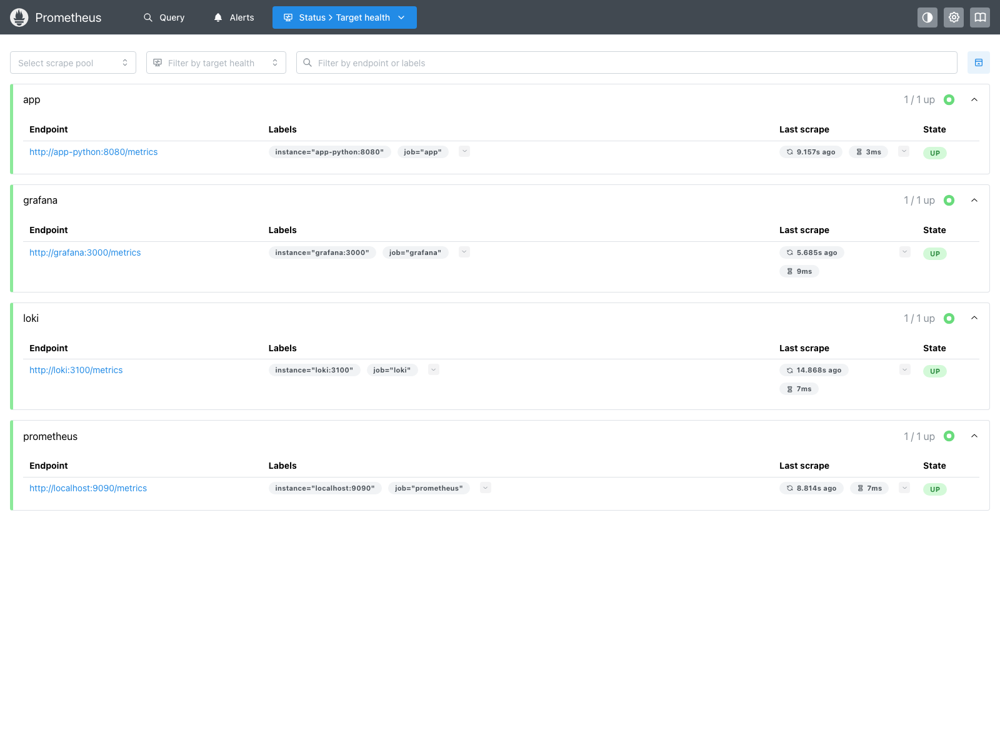
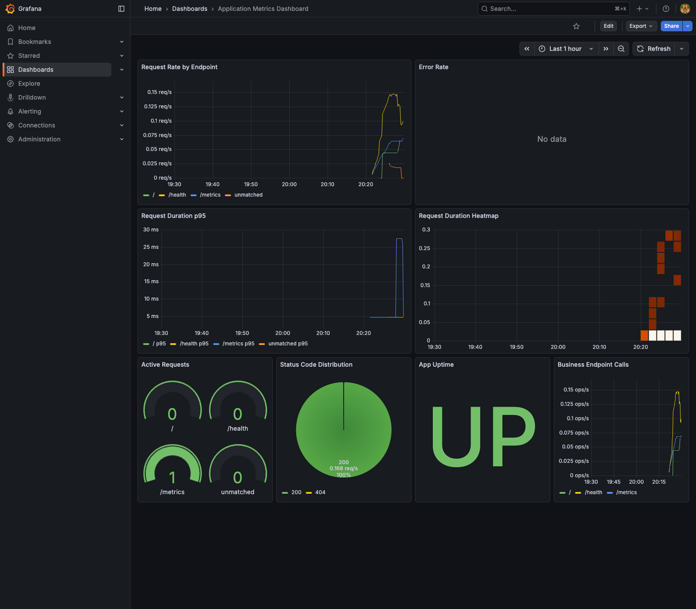

# LAB08 - Metrics and Monitoring with Prometheus

## 1. Architecture



Main metric flow is simple: the Python app exposes `/metrics`, Prometheus scrapes it every 15 seconds, and Grafana visualizes the collected time series. Logs from Lab 7 still work in parallel through Promtail and Loki, so now the stack has both logs and metrics.

All containers run in one `logging` Docker network. For local verification I used `docker compose` and built the Python image from the current repository, because the public image would not contain the new instrumentation from this lab.

## 2. Application Instrumentation

### Added dependency

`app_python/requirements.txt`:

```txt
prometheus-client==0.23.1
```

### Metrics added

I implemented three HTTP metrics required by the lab and two small application-specific metrics:

- `http_requests_total{method,endpoint,status_code}` - Counter for total request count.
- `http_request_duration_seconds{method,endpoint,status_code}` - Histogram for latency distribution.
- `http_requests_in_progress{method,endpoint}` - Gauge for currently running requests.
- `devops_info_endpoint_calls_total{endpoint}` - Counter for business-level endpoint usage.
- `devops_info_system_collection_seconds` - Histogram for time spent collecting system information.

### Code with metric definitions

```python
HTTP_REQUESTS_TOTAL = Counter(
    "http_requests_total",
    "Total HTTP requests handled by the service",
    ["method", "endpoint", "status_code"],
)
HTTP_REQUEST_DURATION_SECONDS = Histogram(
    "http_request_duration_seconds",
    "HTTP request duration in seconds",
    ["method", "endpoint", "status_code"],
)
HTTP_REQUESTS_IN_PROGRESS = Gauge(
    "http_requests_in_progress",
    "HTTP requests currently being processed",
    ["method", "endpoint"],
)
DEVOPS_INFO_ENDPOINT_CALLS = Counter(
    "devops_info_endpoint_calls",
    "Application endpoint usage",
    ["endpoint"],
)
DEVOPS_INFO_SYSTEM_COLLECTION_SECONDS = Histogram(
    "devops_info_system_collection_seconds",
    "Time spent collecting system information",
)
```

### Why these metrics

This set follows the RED method:

- Rate - `http_requests_total`
- Errors - `http_requests_total{status_code=~"4..|5.."}`
- Duration - `http_request_duration_seconds`

I also normalized unknown URLs to label `unmatched` instead of storing raw paths like `/foo/123`, because Prometheus labels should have low cardinality.

### Important implementation details

- Metrics are collected in FastAPI middleware.
- `/metrics` is exposed directly from the app with `generate_latest()`.
- The main endpoint `/` also measures how long system-info collection takes.
- I changed `uvicorn.run("app:app", ...)` to `uvicorn.run(app, ...)` because otherwise the module was imported twice inside the container and Prometheus raised duplicated timeseries errors.

### Evidence: `/metrics` endpoint

```text
$ curl http://localhost:8000/metrics | sed -n '1,25p'
# HELP python_gc_objects_collected_total Objects collected during gc
# TYPE python_gc_objects_collected_total counter
...
# HELP http_requests_total Total HTTP requests handled by the service
# TYPE http_requests_total counter
http_requests_total{endpoint="/health",method="GET",status_code="200"} 10.0
http_requests_total{endpoint="/metrics",method="GET",status_code="200"} 7.0
http_requests_total{endpoint="unmatched",method="GET",status_code="404"} 5.0
```


## 3. Prometheus Configuration

File: `monitoring/prometheus/prometheus.yml`

```yaml
global:
  scrape_interval: 15s
  evaluation_interval: 15s

scrape_configs:
  - job_name: prometheus
    static_configs:
      - targets:
          - localhost:9090

  - job_name: app
    metrics_path: /metrics
    static_configs:
      - targets:
          - app-python:8080

  - job_name: loki
    metrics_path: /metrics
    static_configs:
      - targets:
          - loki:3100

  - job_name: grafana
    metrics_path: /metrics
    static_configs:
      - targets:
          - grafana:3000
```

### Retention

Prometheus retention is configured in `monitoring/docker-compose.yml` through command flags:

```yaml
command:
  - --config.file=/etc/prometheus/prometheus.yml
  - --storage.tsdb.retention.time=15d
  - --storage.tsdb.retention.size=10GB
```

Data is stored in persistent volume `prometheus-data`, so metrics survive container restart.

### Evidence: all scrape targets are UP

```text
$ curl http://localhost:9090/api/v1/targets | jq '.data.activeTargets[] | {job: .labels.job, health: .health}'
{ "job": "app", "health": "up" }
{ "job": "grafana", "health": "up" }
{ "job": "loki", "health": "up" }
{ "job": "prometheus", "health": "up" }
```



### Evidence: PromQL `up`

```text
$ curl 'http://localhost:9090/api/v1/query?query=up' | jq '.data.result[] | {job: .metric.job, instance: .metric.instance, value: .value[1]}'
{ "job": "prometheus", "instance": "localhost:9090", "value": "1" }
{ "job": "loki", "instance": "loki:3100", "value": "1" }
{ "job": "app", "instance": "app-python:8080", "value": "1" }
{ "job": "grafana", "instance": "grafana:3000", "value": "1" }
```


## 4. Grafana Dashboard Walkthrough

Exported dashboard JSON:

- `monitoring/grafana/provisioning/dashboards/app-metrics.json`
- `monitoring/grafana/provisioning/dashboards/app-logs.json`

For local setup I added Grafana data sources and imported dashboards through Grafana HTTP API commands. This gave a repeatable command-line setup and kept the exported JSON files in the repository.

### Dashboard panels

The custom metrics dashboard contains 8 panels:

1. `Request Rate by Endpoint`
   - Query: `sum by (endpoint) (rate(http_requests_total{job="app"}[5m]))`
   - Shows request frequency for `/`, `/health`, `/metrics`.

2. `Error Rate`
   - Query: `sum(rate(http_requests_total{job="app",status_code=~"5.."}[5m]))`
   - Shows server-side 5xx errors.

3. `Request Duration p95`
   - Query: `histogram_quantile(0.95, sum by (le, endpoint) (rate(http_request_duration_seconds_bucket{job="app"}[5m])))`
   - Shows 95th percentile latency.

4. `Request Duration Heatmap`
   - Query: `sum by (le) (rate(http_request_duration_seconds_bucket{job="app"}[5m]))`
   - Visualizes latency buckets.

5. `Active Requests`
   - Query: `sum by (endpoint) (http_requests_in_progress{job="app"})`
   - Shows current concurrent requests.

6. `Status Code Distribution`
   - Query: `sum by (status_code) (rate(http_requests_total{job="app"}[5m]))`
   - Splits successful and failed requests.

7. `App Uptime`
   - Query: `up{job="app"}`
   - Single stat: 1 means healthy.

8. `Business Endpoint Calls`
   - Query: `sum by (endpoint) (rate(devops_info_endpoint_calls_total[5m]))`
   - Shows business usage of endpoints.

### Grafana API commands used

```bash
curl -u "$GF_ADMIN_USER:$GF_ADMIN_PASSWORD" \
  -H 'Content-Type: application/json' \
  -X POST http://localhost:3000/api/datasources \
  -d '{"name":"Prometheus","type":"prometheus","access":"proxy","url":"http://prometheus:9090","isDefault":true}'

curl -u "$GF_ADMIN_USER:$GF_ADMIN_PASSWORD" \
  -H 'Content-Type: application/json' \
  -X POST http://localhost:3000/api/dashboards/db \
  -d @/tmp/grafana-app-metrics-payload.json
```

### Evidence

```text
$ curl -u admin:*** 'http://localhost:3000/api/search?type=dash-db' | jq '.[] | {title, uid}'
{ "title": "Application Logs Dashboard", "uid": "app-logs-dashboard" }
{ "title": "Application Metrics Dashboard", "uid": "app-metrics-dashboard" }
```

The screenshot below shows the custom application dashboard with all 8 panels working on live data.



## 5. PromQL Examples

### 1. Request rate by endpoint

```promql
sum by (endpoint) (rate(http_requests_total{job="app"}[5m]))
```

Result sample:

```text
{ "endpoint": "/metrics", "value": "0.05422262479871175" }
{ "endpoint": "/health",  "value": "0.13349219672571122" }
{ "endpoint": "/",        "value": "0.04444444444444445" }
```

### 2. Status code distribution

```promql
sum by (status_code) (rate(http_requests_total{job="app"}[5m]))
```

After I generated some 404 requests deliberately:

```text
{ "status_code": "200", "value": "0.24855363984674333" }
{ "status_code": "404", "value": "0.026077235772357727" }
```

### 3. Raw 404 counter

```promql
http_requests_total{job="app",status_code="404"}
```

```text
{ "endpoint": "unmatched", "value": "5" }
```

### 4. p95 latency by endpoint

```promql
histogram_quantile(0.95, sum by (le, endpoint) (rate(http_request_duration_seconds_bucket{job="app"}[5m])))
```

```text
{ "endpoint": "/metrics", "value": "0.00475" }
{ "endpoint": "/health",  "value": "0.00475" }
{ "endpoint": "/",        "value": "0.00475" }
```

### 5. Business endpoint calls

```promql
sum by (endpoint) (rate(devops_info_endpoint_calls_total[5m]))
```

```text
{ "endpoint": "/metrics", "value": "0.061070542706292696" }
{ "endpoint": "/health",  "value": "0.13350460950080517" }
{ "endpoint": "/",        "value": "0.04444444444444445" }
```

### 6. Service uptime

```promql
up{job="app"}
```

```text
{ "job": "app", "instance": "app-python:8080", "value": "1" }
```

## 6. Production Setup

### Health checks

All local services now have health checks in `monitoring/docker-compose.yml`:

- Prometheus - `/-/healthy`
- Loki - `/ready`
- Grafana - `/api/health`
- app-python - Python one-liner calling `/health`
- app-java - `wget` against `/health`
- Promtail - binary-level `promtail -version` probe

### Resource limits

Configured resource limits:

| Service | CPU limit | Memory limit |
|--------|-----------|--------------|
| Prometheus | 1.0 | 1G |
| Loki | 1.0 | 1G |
| Grafana | 0.5 | 512M |
| app-python | 0.5 | 256M |
| app-java | 0.5 | 256M |
| Promtail | 0.5 | 512M |

### Persistent volumes

Defined volumes:

```yaml
volumes:
  prometheus-data:
  loki-data:
  grafana-data:
```

### Persistence proof

I restarted the stack with `docker compose down` and `docker compose up -d` without deleting volumes. Dashboards and data sources still existed after restart:

```text
--- dashboards after restart ---
{ "title": "Application Logs Dashboard", "uid": "app-logs-dashboard" }
{ "title": "Application Metrics Dashboard", "uid": "app-metrics-dashboard" }

--- datasources after restart ---
{ "name": "Loki", "type": "loki", "isDefault": false }
{ "name": "Prometheus", "type": "prometheus", "isDefault": true }
```

## 7. Metrics vs Logs

Metrics and logs solve different problems, so together they are much stronger than separately.

- Metrics answer questions like: how many requests per second, what is p95 latency, how many errors are happening now.
- Logs answer questions like: what exactly failed, which endpoint threw the exception, what was the message and context.

Example from this project:

- If request rate suddenly drops, Prometheus shows that immediately.
- To understand why, I can open the logs dashboard from Lab 7 and inspect the JSON log lines from the app.

So my conclusion is simple: metrics are better for fast overview and trend analysis, logs are better for root-cause investigation.

## 8. Testing Results

### Unit tests

```text
$ ./.venv-ci/bin/pytest -q
......                                                                   [100%]
6 passed in 0.20s
```

### Ruff check

```text
$ ./.venv-ci/bin/ruff check app.py tests/test_endpoints.py
All checks passed!
```

### Docker Compose status

After final restart all services became healthy:

```text
$ docker compose ps
NAME         IMAGE                            STATUS
app-java     devops-info-service-java:lab08   Up 50 seconds (healthy)
app-python   devops-info-service-python:lab08 Up 50 seconds (healthy)
grafana      grafana/grafana:12.3.1           Up 24 seconds (healthy)
loki         grafana/loki:3.0.0               Up 50 seconds (healthy)
prometheus   prom/prometheus:v3.9.0           Up 50 seconds (healthy)
promtail     grafana/promtail:3.0.0           Up 24 seconds (healthy)
```

### Prometheus targets

```text
$ curl http://localhost:9090/api/v1/targets | jq '.data.activeTargets[] | {job: .labels.job, health: .health}'
{ "job": "app", "health": "up" }
{ "job": "grafana", "health": "up" }
{ "job": "loki", "health": "up" }
{ "job": "prometheus", "health": "up" }
```

## 9. Challenges and Solutions

### 1. Duplicated Prometheus timeseries on app startup

Problem:

- The container started `python app.py`.
- Inside `main()` I called `uvicorn.run("app:app", ...)`.
- Uvicorn imported the same module a second time, so all Prometheus counters were registered twice.

Fix:

- Changed startup to `uvicorn.run(app, ...)`.

### 2. Promtail health check kept reporting unhealthy

Problem:

- The Promtail image does not include `wget`, so the first health check command always failed even though Promtail itself was working.

Fix:

- Replaced the probe with `promtail -version`, which is available in the container.

### 3. Local image rebuild for the updated app

Problem:

- The old Docker image from previous labs did not know anything about `/metrics`.

Fix:

- In local `monitoring/docker-compose.yml` I switched `app-python` to build from `../app_python`.

## 10. Bonus - Ansible Automation

For the bonus part I extended the Ansible monitoring role so it fits the same Yandex Cloud VM workflow from previous labs:

- added Prometheus variables in `ansible/roles/monitoring/defaults/main.yml`
- added `prometheus.yml.j2`
- updated monitoring Docker Compose template with Prometheus service
- added Grafana Prometheus datasource template
- added Grafana dashboard provider template
- copied logs and metrics dashboard JSON files into `ansible/roles/monitoring/files/`
- updated app deployment template to add labels for Promtail discovery

`ansible-playbook playbooks/deploy-monitoring.yml --syntax-check` passes.
